## Università degli Studi dell'Insubria


Dipartimento di Scienze Teoriche Applicate Corso di Studio Triennale in Informatica

#### Generazione di Dati Realistici Railway-IIoT mediante Machine Learning

#### Relatore

Dr. Jesus Fernando Cevallos Moreno

#### Correlatore

Prof.ssa Alessandra Rizzardi

Candidato

Federico Rogora

Matricola

734576

Anno Accademico 2024/2025

# Indice

| 1 |                                               | Introduzione                                                                                                                                                                                                                                                                                                                                      | 3                                    |
|---|-----------------------------------------------|---------------------------------------------------------------------------------------------------------------------------------------------------------------------------------------------------------------------------------------------------------------------------------------------------------------------------------------------------|--------------------------------------|
| 2 | 2.1<br>2.2<br>2.3<br>2.4<br>2.5<br>2.6<br>2.7 | Stato dell'arte<br>Evoluzione della manutenzione in ambito ferroviario<br><br>Struttura del processo di raccolta ed elaborazione dei dati<br>Machine learning e anomaly detection<br><br>Sistemi predittivi già esistenti<br>Sfide e limiti attuali<br><br>Approcci emergenti e direzioni di sviluppo<br>Conclusioni e spunti per il proseguo<br> | 5<br>5<br>5<br>6<br>7<br>7<br>8<br>8 |
| 3 |                                               | Descrizione del dataset e delle tecnologie                                                                                                                                                                                                                                                                                                        | 9                                    |
|   | 3.1                                           | Struttura del dataset                                                                                                                                                                                                                                                                                                                             | 9                                    |
|   |                                               | 3.1.1<br>Quantità di record disponibili e filtraggi<br>                                                                                                                                                                                                                                                                                           | 10                                   |
|   | 3.2                                           | Scelta di Python come linguaggio di programmazione                                                                                                                                                                                                                                                                                                | 10                                   |
|   | 3.3                                           | Tecniche di machine learning impiegate<br>                                                                                                                                                                                                                                                                                                        | 10                                   |
|   |                                               | 3.3.1<br>Random Forest                                                                                                                                                                                                                                                                                                                            | 11                                   |
|   |                                               | 3.3.2<br>Copule per modellazione e generazione dei dati<br>                                                                                                                                                                                                                                                                                       | 11                                   |
|   | 3.4                                           | Conclusioni del capitolo<br>                                                                                                                                                                                                                                                                                                                      | 12                                   |
| 4 |                                               | Analisi dei dati e addestramento del modello Random Forest                                                                                                                                                                                                                                                                                        | 14                                   |
|   | 4.1                                           | Scelta del componente 'vehicle'<br>                                                                                                                                                                                                                                                                                                               | 14                                   |
|   | 4.2                                           | Unione del dataset con le classificazioni<br>                                                                                                                                                                                                                                                                                                     | 14                                   |
|   | 4.3                                           | Rappresentazione grafica dei dati                                                                                                                                                                                                                                                                                                                 | 15                                   |
|   | 4.4                                           | Filtraggio del dataset per il componente 'vehicle'<br>                                                                                                                                                                                                                                                                                            | 18                                   |
|   | 4.5                                           | Distribuzione degli eventi<br>                                                                                                                                                                                                                                                                                                                    | 19                                   |
|   | 4.6                                           | Aggiunta della colonna 'Tipo_Evento_Classificato'                                                                                                                                                                                                                                                                                                 | 21                                   |
|   | 4.7                                           | Rimozione delle righe con valori mancanti<br>                                                                                                                                                                                                                                                                                                     | 21                                   |
|   | 4.8                                           | Matrice di correlazione delle feature numeriche<br>                                                                                                                                                                                                                                                                                               | 22                                   |
|   | 4.9                                           | Addestramento del modello Random Forest e valutazione<br>                                                                                                                                                                                                                                                                                         | 24                                   |
| 5 |                                               | Distribuzioni temporali dei log                                                                                                                                                                                                                                                                                                                   | 27                                   |
|   | 5.1                                           | Pulizia e preparazione dei dati<br>                                                                                                                                                                                                                                                                                                               | 27                                   |
|   | 5.2                                           | Calcolo del tempo di interarrivo delle anomalie<br>                                                                                                                                                                                                                                                                                               | 28                                   |
|   | 5.3                                           | Filtraggio del tempo di interarrivo<br>                                                                                                                                                                                                                                                                                                           | 28                                   |
|   | 5.4                                           | Analisi della distribuzione esponenziale dei tempi di interarrivo<br>                                                                                                                                                                                                                                                                             | 29                                   |
|   | 5.5                                           | Calcolo del tempo di interarrivo dei funzionamenti normali<br>                                                                                                                                                                                                                                                                                    | 30                                   |
|   | 5.6                                           | Filtraggio del tempo di interarrivo dei funzionamenti normali<br>                                                                                                                                                                                                                                                                                 | 31                                   |
|   | 5.7                                           | Analisi della distribuzione dei tempi di interarrivo per i funzionamenti normali<br>                                                                                                                                                                                                                                                              | 31                                   |
|   | 5.8                                           | Calcolo di media e mediana dei tempi di interarrivo                                                                                                                                                                                                                                                                                               | 32                                   |

| 6 |     | Generazione dei dati sintetici                               | 34 |
|---|-----|--------------------------------------------------------------|----|
|   | 6.1 | Preparazione del dataset per la generazione<br>              | 34 |
|   | 6.2 | Rimozione dei duplicati consecutivi                          | 35 |
|   | 6.3 | Generazione di dati sintetici con copula Gaussiana<br>       | 36 |
|   | 6.4 | Valutazione dei dati sintetici generati                      | 37 |
|   |     | 6.4.1<br>Media e mediana dei tempi di interarrivo<br>        | 38 |
|   |     | 6.4.2<br>Matrice di correlazione delle feature numeriche<br> | 38 |
|   | 6.5 | Valutazione del modello Random Forest sui dati sintetici     | 40 |
|   | 6.6 | Confronto grafico tra dataset pulito e sintetico<br>         | 43 |
| 7 |     | Script per la generazione dei log                            | 46 |
|   | 7.1 | Panoramica dello script finale di generazione dei log<br>    | 46 |
|   | 7.2 | Funzionamento dello script<br>                               | 47 |
|   | 7.3 | Codice dello script<br>                                      | 47 |
|   | 7.4 | Conclusioni<br>                                              | 50 |
| 8 |     | Conclusioni e sviluppi futuri                                | 51 |

## Capitolo 1

# Introduzione

L'industria ferroviaria rappresenta uno dei settori più complessi e critici per quanto riguarda la gestione operativa e la manutenzione delle infrastrutture. La crescente domanda di sicurezza, affidabilità ed efficienza ha reso indispensabile lo sviluppo di sistemi tecnologicamente avanzati in grado di monitorare, analizzare e prevedere eventuali guasti o anomalie.

I treni moderni, essendo sistemi composti da numerosi componenti interconnessi, generano grandi quantità di dati tramite sensori installati in varie parti, come motori, sistemi frenanti, batterie e sistemi di controllo. Questi dati, noti come log operativi, contengono informazioni essenziali per comprendere il funzionamento del sistema nel tempo e rilevare eventuali anomalie. Tuttavia, la quantità di dati raccolti rappresenta una sfida significativa, sia in termini di analisi che di interpretazione, per garantire una gestione ottimale delle operazioni ferroviarie.

Negli ultimi anni, il machine learning si è affermato come una tecnologia chiave per risolvere problemi complessi in diversi settori. In ambito sanitario, ad esempio, i modelli predittivi vengono utilizzati per diagnosticare malattie in fase precoce, mentre nel settore automobilistico alimentano i sistemi di guida autonoma, analizzando l'ambiente circostante e prendendo decisioni in tempo reale. Anche nel settore ferroviario, il machine learning offre opportunità significative, consentendo di:

- identificare anomalie nei dati dei sensori che potrebbero indicare guasti imminenti;
- ottimizzare i piani di manutenzione riducendo i costi operativi;
- migliorare la sicurezza e l'affidabilità complessiva del sistema.

Per garantire prestazioni elevate, i modelli di machine learning richiedono una quantità significativa di dati di alta qualità. Tuttavia, la disponibilità di tali dati rappresenta spesso un limite. Molti dataset reali risultano incompleti, scarsamente rappresentativi o sbilanciati. Per affrontare questo problema, è possibile ricorrere alla generazione di dati sintetici, ovvero dati generati artificialmente mediante algoritmi, in grado di riprodurre fedelmente le caratteristiche statistiche dei dati reali.

Questa tesi si concentra sullo sviluppo di un sistema per la generazione e l'analisi di dati sintetici, specificamente progettato per il contesto ferroviario. In particolare:

- Generazione di dati sintetici: I dati sintetici sono stati creati utilizzando una tecnica basata su copule, un approccio matematico in grado di catturare accuratamente le correlazioni e le dipendenze tra le variabili del dataset originale. Questo garantisce che i dati sintetici siano statisticamente coerenti con i dati reali, pur offrendo maggiore flessibilità e disponibilità.
- Validazione dei dati sintetici: Per verificare l'affidabilità e la qualità dei dati generati, è stato utilizzato un modello di machine learning basato sull'algoritmo Random Forest, noto per la sua robustezza e versatilità. Questo algoritmo consente di classificare gli eventi come anomalie o funzionamenti normali, fornendo un indicatore diretto dell'utilità dei dati sintetici nel supportare applicazioni predittive reali.

Struttura della tesi: La tesi si articola come segue:

- Capitolo 2 Stato dell'arte: Presenta le principali tecniche di machine learning per la manutenzione predittiva ferroviaria, le metodologie di generazione di dati sintetici (GAN, copule, simulazioni) e gli attuali sistemi per la manutenzione del settore ferroviario.
- Capitolo 3 Descrizione delle tecnologie e del dataset: Descrive il dataset utilizzato, le tecnologie e gli strumenti impiegati (Python, librerie per il ML e per la generazione di dati sintetici).
- Capitolo 4 Analisi dei dati e addestramento del modello Random Forest: Illustra la fase di scelta del componente ferroviario, la preparazione dei dati e l'addestramento del modello Random Forest per la classificazione di anomalie e funzionamenti normali.
- Capitolo 5 Distribuzioni temporali dei log: Analizza i pattern temporali degli eventi e verifica la possibile modellazione dei tempi di interarrivo con distribuzioni esponenziali.
- Capitolo 6 Generazione dei dati sintetici: Mostra il processo di generazione dei dati sintetici mediante copule gaussiane, la validazione statistica e la verifica tramite il modello di classificazione.
- Capitolo 7 Script per la generazione dei log: Presenta uno script automatico per la creazione continua di log sintetici, utile per scenari di simulazione.
- Capitolo 8 Conclusioni e implementazioni future: Conclude il lavoro, evidenziando i risultati ottenuti e possibili direzioni future.

## Capitolo 2

# Stato dell'arte

La manutenzione predittiva nel settore ferroviario rappresenta un'area di ricerca e sviluppo in costante evoluzione, grazie alla crescente disponibilità di sensori IoT e di tecnologie di machine learning. L'importanza di evitare fermi imprevisti e garantire un elevato livello di sicurezza ha spinto numerose aziende e centri di ricerca a esplorare soluzioni avanzate per anticipare guasti e ridurre i costi operativi associati alla manutenzione. In questo capitolo si presentano le principali ricerche e tecnologie correlate alla manutenzione predittiva ferroviaria, approfondendo l'intero processo di raccolta ed elaborazione dei dati, gli approcci di anomaly detection e le sfide ancora aperte.

## 2.1 Evoluzione della manutenzione in ambito ferroviario

La manutenzione in ambito ferroviario ha subito un processo di trasformazione graduale. Inizialmente, si faceva ricorso a strategie di tipo correttivo: gli interventi erano eseguiti dopo il manifestarsi del guasto, con il rischio di interrompere il servizio e provocare disagi significativi. Successivamente, l'attenzione si è spostata verso la manutenzione preventiva, nella quale ogni componente veniva sostituito o revisionato a intervalli periodici (temporali o chilometrici) indipendentemente dalle effettive condizioni di usura. Questo approccio, sebbene migliore rispetto a quello correttivo, comporta spesso costi elevati e la sostituzione prematura di pezzi ancora pienamente funzionali.

Con l'avvento di sensori IoT a basso costo e l'aumento della potenza di calcolo disponibile, si è affermato il concetto della manutenzione predittiva. In tale contesto, le informazioni raccolte a bordo treno (ad esempio, dati sulle vibrazioni, correnti, tensioni, pressioni, temperature e posizioni GPS) vengono analizzate con algoritmi di machine learning per stimare il grado di usura di un componente e individuare eventuali segni di deterioramento [7, 17]. Tale innovazione risponde alla necessità, sempre più avvertita dagli operatori ferroviari, di ridurre i tempi di fermo e garantire la massima disponibilità del materiale rotabile, prevedendo gli interventi di manutenzione prima che si verifichi un guasto effettivo.

## 2.2 Struttura del processo di raccolta ed elaborazione dei dati

Per comprendere come la manutenzione predittiva venga implementata nella pratica, è utile delineare la catena di raccolta ed elaborazione dei dati (data pipeline), che si compone di:

#### 1. Sensori e sistemi di bordo

I treni moderni sono equipaggiati con numerosi sensori, installati su motori, sistemi frenanti, porte, condizionatori e altri sottosistemi. Tali sensori misurano parametri fisici (ad esempio vibrazioni, temperature, correnti) o segnali digitali (allarmi elettrici, stati logici di funzionamento), registrati a frequenze spesso differenti. Secondo Huang et al. [12], la qualità e l'eterogeneità di queste rilevazioni rappresentano uno dei primi fattori critici nel processo di manutenzione predittiva.

#### 2. Trasmissione dei dati

I dati raccolti a bordo treno possono essere inviati in tempo reale a una centrale operativa mediante reti wireless (ad esempio 4G/5G) o salvati in registratori di bordo e scaricati a intervalli regolari (in deposito o in stazione). La scelta della modalità di trasmissione dipende dalle esigenze di real-time e dalla disponibilità di copertura di rete: Qi et al. [17] osservano come alcuni sistemi ferroviari ad alta velocità sfruttino reti mobili dedicate per garantire latenza ridotta.

#### 3. Infrastruttura di ingestione e archiviazione

Una volta ricevuti, i log vengono inseriti (o ingestiti) in piattaforme di big data o in database progettati per gestire grandi volumi di informazioni. Qui avviene una prima fase di data cleaning e pre-processing, con l'obiettivo di uniformare i formati, rimuovere valori anomali o mancanti e sincronizzare temporalmente le letture [7]. Alcune aziende adottano architetture cloud-based (come AWS, Azure o Google Cloud) per assicurare scalabilità, mentre altre preferiscono soluzioni on-premise per motivi di sicurezza e riservatezza dei dati.

#### 4. Moduli di analisi e machine learning

Una volta che i dati sono stati ripuliti e archiviati, viene avviata la fase di analisi vera e propria. Le piattaforme di manutenzione predittiva implementano algoritmi di machine learning (ad esempio Random Forest, SVM, reti neurali) o tecniche statistiche (modelli di regressione, time series analysis) per rilevare anomalie o prevedere i tempi di guasto [3, 6]. Nei sistemi più avanzati, l'analisi può avvenire in batch (aggregando dati di periodi definiti) oppure in streaming (quasi in tempo reale).

#### 5. Visualizzazione e azione di manutenzione

I risultati delle elaborazioni (per esempio, un indice di salute del componente o un allarme di possibile guasto imminente) vengono presentati su dashboard di monitoraggio o inviati a un CMMS (Computerized Maintenance Management System). Gli operatori di manutenzione, così allertati, possono programmare interventi mirati, evitando che la criticità degeneri in un fermo macchina. Hitachi Rail e Alstom, con le loro piattaforme Predictive Maintenance e HealthHub, forniscono esempi concreti di questa integrazione [20].

## 2.3 Machine learning e anomaly detection

L'elemento centrale del processo di manutenzione predittiva è rappresentato dagli algoritmi di anomaly detection. Come evidenziato da Chandola et al. [6], tali algoritmi possono essere supervisionati, non supervisionati o semi-supervisionati, a seconda che si disponga di un insieme di dati etichettati (guasto / funzionamento normale). Nel settore ferroviario, la reale disponibilità di etichette di guasto è spesso limitata, poiché gli eventi anomali sono fortunatamente rari e non sempre ben documentati.

#### Metodi supervisionati

In presenza di dataset contenenti sufficienti esempi di guasti, si ottengono ottimi risultati con reti neurali profonde (deep learning), SVM o metodi ensemble. Ad esempio, Huang et al. [12] sfruttano architetture LSTM in grado di riconoscere variazioni minime nei segnali operativi, anticipando guasti meccanici con notevole accuratezza.

#### Metodi non supervisionati

Quando mancano etichette affidabili, i metodi di clustering o di density-based detection (come DBSCAN) possono rivelarsi utili. Questi algoritmi identificano raggruppamenti di dati e segnalano gli outlier, ossia i punti che si discostano in modo significativo dal normale comportamento [6].

#### Metodi semi-supervisionati

Rappresentano una via di mezzo e sfruttano poche etichette di guasto affiancate da un grande volume di dati non etichettati. In contesti ferroviari, ciò è rilevante perché spesso si conoscono solo alcuni esempi di guasti reali, mentre si dispone di molti log di operatività normale.

In parallelo, numerosi studi raccomandano la modellazione temporale e l'adozione di reti neurali sequenziali (LSTM, GRU) per processi che evolvono gradualmente [17]. Tale approccio risulta cruciale quando i componenti si degradano lentamente, mostrando segnali di deterioramento nell'arco di settimane o mesi.

## 2.4 Sistemi predittivi già esistenti

L'interesse per la manutenzione predittiva non si limita a livello accademico: aziende come Siemens, Alstom, Hitachi e Talgo hanno sviluppato piattaforme integrate per il monitoraggio e l'analisi dei dati provenienti dalle loro flotte. Tali sistemi si basano su un'architettura cloud o on-premise capace di:

- Raccogliere flussi di dati dai sottosistemi di bordo;
- Ingerire tali flussi in un data lake o in un database strutturato;
- Elaborare le informazioni con algoritmi di machine learning (in batch o in streaming);
- Generare avvisi o allarmi rivolti al personale di manutenzione;
- Interfacciarsi con i sistemi di gestione della manutenzione per pianificare gli interventi.

Ad esempio, Siemens Railigent fornisce un servizio di fleet monitoring che combina analisi diagnostiche e predittive, con la possibilità di visualizzare in modo intuitivo lo stato di salute del convoglio o di singoli componenti. Alstom HealthHub, invece, adotta un approccio di condition monitoring continuo su parametri come vibrazioni e temperature, integrando in piattaforme cloud i dati provenienti da centinaia di sensori [20].

## 2.5 Sfide e limiti attuali

Nonostante i vantaggi apportati dalla manutenzione predittiva, persistono diverse criticità. Tra le più rilevanti:

#### Qualità e completezza dei dati

Data la natura dei sensori e delle reti di trasmissione, errori di misura, valori mancanti o rumorosi sono frequenti [7]. Una buona parte del lavoro di data engineering consiste nel normalizzare i valori, gestire i missing data ed eventualmente ricorrere a metodi di imputazione statistica.

#### Eterogeneità dei sistemi

I treni sono costituiti da molteplici sottosistemi (motori, freni, condizionamento, porte) che producono dati a formati e frequenze diversi [17]. Integrare tali flussi in un'unica piattaforma di analisi richiede scelte progettuali mirate e standard condivisi.

#### Rarità delle anomalie

Se da un lato è positivo che i guasti siano poco comuni, dall'altro ciò limita la disponibilità di esempi etichettati, complicando l'addestramento dei modelli di anomaly detection [12]. Tale problematica motiva, ad esempio, lo sviluppo di metodi semi-supervisionati o di few-shot learning.

#### Concept drift e variazioni operative

Le condizioni di esercizio di un treno possono variare a causa di fattori ambientali, stagionali o legati alla linea ferroviaria. Xiao e Wen [18] evidenziano come i modelli vadano periodicamente riaddestrati o ricalibrati per fronteggiare tali cambiamenti e mantenere buone prestazioni predittive.

#### Requisiti di real-time

In alcuni scenari è necessario che la diagnostica avvenga in tempo reale, per segnalare un'anomalia mentre il treno è in esercizio [20]. Questo comporta scelte architetturali tese a minimizzare la latenza di elaborazione (ad esempio edge computing a bordo treno o pipeline di streaming con elaborazione distribuita).

#### Scarsità di dataset condivisi

Per ragioni di riservatezza o privacy, molte aziende non rilasciano dataset completi di log operativi, rendendo difficile il confronto su benchmark standardizzati e ostacolando la verifica incrociata dei risultati di ricerca.

## 2.6 Approcci emergenti e direzioni di sviluppo

Negli ultimi anni, si osserva una crescente attenzione verso tecnologie big data e machine learning distribuito, volte a gestire la mole di dati provenienti da flotte di centinaia o migliaia di treni [2]. L'impiego di framework come Apache Spark o Flink permette di eseguire analisi scalabili su cluster di calcolo, riducendo i tempi di addestramento e migliorando la resilienza in caso di guasti ai nodi.

Parallelamente, si stanno sperimentando approcci ibridi che combinano dati reali con simulazioni fisiche dei sistemi meccanici o elettrici. Zhou et al. [19] mostrano come l'unione di dati simulati e reali renda possibili analisi di condizioni di stress difficilmente osservabili nell'esercizio quotidiano, arricchendo i modelli di machine learning con esempi di scenari estremi.

Un altro indirizzo di ricerca riguarda l'integrazione dei dati di infrastruttura, come quelli relativi allo stato dei binari, dei passaggi a livello o delle linee aeree, per ottenere una visione end-to-end del sistema treno-rotaia. In questo modo, si possono rilevare ancor prima situazioni a rischio, coordinando manutenzioni simultanee di veicoli e infrastruttura.

## 2.7 Conclusioni e spunti per il proseguo

Da questa panoramica emerge come la manutenzione predittiva rappresenti un percorso di miglioramento continuo, che si nutre di sensori IoT, algoritmi di machine learning e infrastrutture big data per rendere il materiale rotabile più sicuro, affidabile ed economicamente sostenibile. Le aziende ferroviarie hanno già cominciato a sfruttare tali opportunità, come dimostrano i sistemi di Siemens, Alstom, Hitachi e Talgo, sebbene sussistano sfide notevoli in termini di qualità dei dati, rarità delle anomalie e requisiti di elaborazione in tempo reale.

In prospettiva, si prevede un'ulteriore diffusione di metodologie data-driven sempre più specializzate, una crescita delle soluzioni di edge computing a bordo treno e una maggiore integrazione con dati infrastrutturali. Inoltre, l'adozione di tecniche di data augmentation o synthetic data generation può rivelarsi strategica per addestrare modelli in scenari di scarsità di log di guasto. Nei prossimi capitoli della presente tesi, verranno illustrate le tecniche adottate per integrare dati reali e dati sintetici, discutendo come la fusione di queste due fonti possa potenziare l'accuratezza e la robustezza dei modelli di rilevamento anomalie nel contesto ferroviario.

## Capitolo 3

# Descrizione del dataset e delle tecnologie

In questo capitolo viene presentato il dataset utilizzato per lo sviluppo del sistema di manutenzione predittiva, descrivendone la struttura, la qualità delle informazioni disponibili e la quantità di record effettivamente utilizzati per l'addestramento dei modelli. Successivamente, si illustrano le motivazioni che hanno portato alla scelta di Python come linguaggio di programmazione e si approfondiscono le principali tecniche di machine learning impiegate: il Random Forest e l'adozione delle copule per la generazione e modellazione dei dati, fornendo una spiegazione matematica più completa e, in particolare, soffermandosi sulla copula gaussiana.

## 3.1 Struttura del dataset

Il dataset in esame contiene un'ampia varietà di informazioni registrate a bordo treno, organizzate in gruppi di colonne affini per tipologia o funzione. Per motivi di riservatezza, non vengono riportati i nomi specifici di ogni colonna, bensì una descrizione aggregata delle principali categorie di dati. La Tabella 3.1 illustra la struttura complessiva del dataset.

Tabella 3.1: Riepilogo dei principali gruppi di dati presenti nel dataset (formato compatto).

| Gruppo di dati                  | Breve descrizione                             | Tipo di dato          |  |
|---------------------------------|-----------------------------------------------|-----------------------|--|
| Identificativi e descrizioni ge | Dati<br>anagrafici,<br>codici<br>interni<br>e | Stringa / Categorie   |  |
| nerali                          | campi testuali per riconoscere vei            |                       |  |
|                                 | colo ed evento                                |                       |  |
| Informazioni temporali          | Momenti di apertura e chiusura del            | DateTime / Numeri     |  |
|                                 | l'evento, più una stima della durata          | co                    |  |
| Posizione geografica            | Rilevazioni sulla localizzazione del          | Numerico / Stringa    |  |
|                                 | treno (coordinate) durante l'evento           |                       |  |
| Segnali di stato e diagnostica  | Variabili che descrivono le condizio          | Booleano / Categorie  |  |
|                                 | ni operative e di diagnostica dei sot         |                       |  |
|                                 | tosistemi                                     |                       |  |
| Parametri elettrici e batteria  | Letture di tensioni, correnti, stato          | Numerico (float)      |  |
|                                 | della linea di alimentazione                  |                       |  |
| Pressioni e sistemi frenanti    | Misure di pressione nei freni e altri         | Numerico (float)      |  |
|                                 | valori relativi alla frenatura                |                       |  |
| Allarmi e sovracorrenti         | Segnali di allarme o sovraccarico in          | Booleano / Categorie  |  |
|                                 | caso di condizioni elettriche anoma           |                       |  |
|                                 | le                                            |                       |  |
| Comandi cabina e diagnostica    | Dati dei comandi manuali e di dia             | Misto (Stringa / Bool |  |
| avanzata                        | gnosi specialistica                           | / Num)                |  |

Come illustrato in Tabella 3.1, i dati spaziano da semplici flag di allarme fino a misure numeriche di pressione o tensione, e includono inoltre campi identificativi e geografici. Questa suddivisione

facilita le successive analisi, consentendo di concentrare l'attenzione su specifici domini (ad esempio, pressioni frenanti vs. parametri elettrici) e di risalire alle correlazioni più interessanti per la manutenzione predittiva.

#### 3.1.1 Quantità di record disponibili e filtraggi

Il dataset iniziale presentava circa 50.000 righe. Dopo aver selezionato il componente specifico che si intendeva analizzare in profondità, si è scesi a circa 15.000 record. Da questo sottoinsieme, sono stati successivamente rimossi:

- Record con valori mancanti in campi critici, come i timestamp (obbligatori per collegare evento e istante di diagnosi).
- Record duplicati o inconsistenti, spesso derivanti da più acquisizioni ravvicinate o erroneamente replicate.

A valle di queste operazioni, la quantità finale di record utilizzabile per l'analisi è di circa 5.000 righe.

Nella fase di training e validazione dei modelli di manutenzione predittiva, pertanto, ci si è concentrati su questo dataset ridotto ma pulito (circa 5.000 record), in modo da garantire che i dati fossero coerenti e privi di outlier.

## 3.2 Scelta di Python come linguaggio di programmazione

La fase di analisi, pre-processing e modellazione del dataset è stata interamente condotta in Python, linguaggio che si è affermato come standard de facto in ambito data science. Questa scelta è stata guidata dai seguenti fattori:

- Ampio ecosistema di librerie scientifiche: Python mette a disposizione pacchetti di alto livello come pandas (gestione dati tabellari), NumPy (calcolo numerico), scikit-learn (machine learning) e matplotlib/seaborn (grafici). Grazie a questi strumenti, le operazioni di pulizia, trasformazione e visualizzazione dei dati risultano notevolmente semplificate.
- Flessibilità e rapidità di prototipazione: La sintassi intuitiva di Python consente di sviluppare e testare in tempi ridotti differenti soluzioni di machine learning, permettendo iterazioni agili tra fasi di sperimentazione e di validazione.
- Community attiva e risorse online: Python vanta una comunità internazionale che pubblica costantemente documentazione, tutorial e librerie aggiuntive. Questo bagaglio di conoscenze e supporto risulta cruciale per la risoluzione tempestiva dei problemi e per restare aggiornati sulle ultime innovazioni.
- Integrazione con sistemi big data e cloud: La disponibilità di API e connettori ad hoc facilita l'interazione con soluzioni di cloud computing (AWS, Azure, GCP) o piattaforme big data (Apache Spark), rendendo possibile un'eventuale scalabilità del progetto se il volume di dati cresce.

Alla luce di tali vantaggi, Python è apparso come l'opzione migliore per coprire l'intero pipeline di sviluppo: dall'acquisizione e trasformazione dei dati, fino alla fase di addestramento, validazione e deployment del modello di machine learning.

## 3.3 Tecniche di machine learning impiegate

Nell'ambito di questo lavoro, si sono adottate due metodologie centrali per l'analisi e la creazione di dati sintetici: il Random Forest, finalizzato alla classificazione e al rilevamento di anomalie, e le copule, utilizzate per modellare le dipendenze tra variabili e generare ulteriori osservazioni coerenti con la struttura statistica del dataset reale. La comprensione approfondita di questi due approcci risulta fondamentale per l'implementazione di un sistema di manutenzione predittiva affidabile.

#### 3.3.1 Random Forest

Il Random Forest è un metodo di apprendimento supervisionato proposto da Breiman [3], che combina molteplici alberi decisionali (Decision Trees) in un unico modello ensemble. L'idea di base è quella di ridurre l'overfitting tipico dei singoli alberi decisionali e migliorare la capacità di generalizzazione sfruttando due tecniche chiave:

- Bagging (bootstrap aggregating): ogni albero viene addestrato su un campione del dataset ottenuto con sostituzione (bootstrap). L'uso di campioni differenti tra i vari alberi introduce diversità e riduce la correlazione degli errori.
- Selezione casuale delle feature: a ogni split, solo un sottoinsieme casuale di variabili è considerato per scegliere la migliore suddivisione. Ciò limita ulteriormente il rischio che alcuni alberi dominino il modello finale, evitando di sovradimensionare le feature più rilevanti.

Il risultato è un classificatore (o regressore, a seconda dell'obiettivo) che effettua la predizione per voto di maggioranza o per media dei singoli alberi. Da un punto di vista operativo, il Random Forest assicura:

Robustezza Poiché la previsione finale è data dal consenso di numerosi alberi, il metodo risulta meno sensibile a valori anomali o rumorosi e gestisce agevolmente dati mancanti, purché la percentuale di mancanza non sia troppo elevata.

Versatilità La natura "a blocchi" degli alberi decisionali consente di trattare senza difficoltà feature di natura diversa (numeriche, categoriche, booleane) presenti nei log ferroviari.

Interpretabilità parziale Oltre alla previsione, il Random Forest fornisce metriche di feature importance, utili a identificare le variabili che più influenzano il modello. In un contesto ferroviario, ciò può rivelarsi cruciale per comprendere quali parametri (ad esempio, un certo segnale elettrico o un valore di pressione) risultino particolarmente significativi nella diagnosi di guasto.

Nel contesto ferroviario, la letteratura segnala numerosi esempi di successo nell'applicazione del Random Forest per la rilevazione di guasti o anomalie. Jia et al. [13], ad esempio, mostrano come questa tecnica riesca a individuare, in modo efficace, problemi nelle unità di trazione, fornendo un valido compromesso tra accuratezza delle previsioni e semplicità di interpretazione. Un altro vantaggio rilevante, confermato da diversi autori, è la capacità del Random Forest di lavorare bene anche quando il dataset presenta un certo grado di rumore, condizione tipica dei sistemi ferroviari, dove i dati operativi possono risultare incompleti o affetti da misurazioni imprecise.

#### 3.3.2 Copule per modellazione e generazione dei dati

Oltre alle tecniche di classificazione e anomaly detection, questa tesi sfrutta le copule per descrivere in maniera accurata le dipendenze tra variabili e per generare dati sintetici realistici. Le copule possono essere considerate come funzioni matematiche che separano la struttura di dipendenza tra variabili dalle loro distribuzioni marginali [15, 14, 10].

Fondamenti matematici delle copule Siano X1, X2, . . . , X<sup>n</sup> variabili casuali continue con funzione di distribuzione congiunta F(x1, x2, . . . , xn) e funzioni di distribuzione marginali Fi(xi). Una copula C è una funzione:

$$C: [0,1]^n \to [0,1],$$

tale che:

$$F(x_1,\ldots,x_n) = C(F_1(x_1),F_2(x_2),\ldots,F_n(x_n)).$$

In sostanza, C "incapsula" la struttura di dipendenza multivariata, mentre ogni F<sup>i</sup> descrive la distribuzione marginale di X<sup>i</sup> .

Copula gaussiana Un caso particolarmente diffuso è la copula gaussiana, che assume una struttura di dipendenza basata sulla distribuzione normale multivariata. Se Φ<sup>Σ</sup> denota la distribuzione normale multivariata con matrice di correlazione Σ, allora la copula gaussiana C<sup>Σ</sup> è definita come:

$$C_{\Sigma}(u_1,\ldots,u_n) = \Phi_{\Sigma}(\Phi^{-1}(u_1),\ldots,\Phi^{-1}(u_n)),$$

dove Φ −1 è la funzione inversa (quantile) della distribuzione normale standard. La matrice Σ (di dimensione n × n) governa l'intensità e il tipo di correlazione tra le variabili. In particolare, Σ è una matrice simmetrica e definita positiva, e i suoi elementi σij riflettono la correlazione tra X<sup>i</sup> e X<sup>j</sup> .

#### Vantaggi delle copule

- Flessibilità di modellazione: ciascuna variabile mantiene la propria distribuzione marginale, così da rispecchiare la reale eterogeneità dei fenomeni osservati (es. alcuni valori possono essere quasi normali, altri fortemente asimmetrici).
- Preservazione delle relazioni di dipendenza: la copula permette di catturare correttamente la correlazione — o, in generale, la struttura di dipendenza — tra le variabili. Ciò risulta essenziale per simulare in modo fedele gli aspetti più complessi delle interazioni fra parametri elettrici, pressione o allarmi di diversa natura.
- Data augmentation: quando i dati reali sono limitati (ad esempio in presenza di pochi esempi di guasto), generare nuovi campioni coerenti con le statistiche originali diventa un vantaggio notevole per l'addestramento e la validazione dei modelli di machine learning.

Libreria Python utilizzata Nel progetto, per l'implementazione delle copule, ci si è affidati alla libreria copulas, un pacchetto Python open source specializzato nel fitting e nella generazione di dati tramite copule di diverse famiglie (Gaussiana, t-Student, Clayton, Frank, ecc.)

Applicazione in contesto ferroviario Nel settore ferroviario, le copule risultano particolarmente utili quando si desidera:

- Colmare la scarsità di dati: in molti casi, i dataset di guasto sono estremamente ridotti a causa dell'elevata affidabilità dei sistemi. Le copule consentono di generare dati addizionali che preservano le dipendenze osservate, favorendo l'addestramento di modelli di anomaly detection [7].
- Sperimentare scenari rari: simulare condizioni operative non frequentemente registrate (condizioni estreme di temperatura, sforzo, vibrazione) permette di testare la robustezza dei modelli prima che tali condizioni si manifestino effettivamente.
- Analizzare correlazioni non banali: quando alcune variabili presentano correlazioni non lineari o code pesanti, l'adozione di copule specializzate (ad esempio copula t-Student) può rendere la modellazione più realistica rispetto a un semplice approccio multivariato gaussiano.

Nonostante esistano anche metodologie più avanzate per la generazione di dati, le copule conservano un pregio di semplicità concettuale e controllo diretto sulla matrice di correlazione. In questo progetto, si è optato per una copula gaussiana come primo approccio, poiché le analisi preliminari hanno evidenziato correlazioni prevalentemente lineari e una discreta aderenza dei dati a distribuzioni simili alla Normale. In caso di scenari più complessi, altre famiglie di copule (t-Student, Archimedea, Vine Copula, ecc.) sarebbero state prese in considerazione.

## 3.4 Conclusioni del capitolo

In questo capitolo è stato descritto il dataset ferroviario, evidenziando sia la struttura sia le quantità di record disponibili a monte e a valle dei processi di pulizia e filtraggio (inizialmente circa 50.000, ridotti a 15.000 dopo la selezione del componente da analizzare, e infine 5.000 record dopo la rimozione di duplicati e valori mancanti critici). Sono state inoltre approfondite le due principali tecniche di machine learning adottate: il Random Forest, capace di unire robustezza e parziale interpretabilità grazie a meccanismi di bagging e feature importance, e le copule, accompagnate da una spiegazione matematica più dettagliata e da un esempio illustrativo della copula gaussiana.

Nel contesto ferroviario, dove guasti e anomalie sono spesso rari, queste tecniche consentono di ampliare i dati disponibili (data augmentation) e di migliorare l'accuratezza dei modelli di anomaly detection. Nei capitoli successivi verrà mostrato come tali metodologie vengano concretamente integrate nel workflow di manutenzione predittiva, analizzando le fasi di preprocessing, addestramento, validazione e generazione di log sintetici.

## Capitolo 4

# Analisi dei dati e addestramento del modello Random Forest

Questo capitolo illustra il processo di analisi e modellazione dei dati finalizzato alla classificazione degli eventi registrati dai sensori installati sul treno. In particolare, descrive i criteri utilizzati per selezionare il componente Vehicle, l'elaborazione del dataset, e l'applicazione dell'algoritmo Random Forest per distinguere tra anomalie e funzionamenti normali.

## 4.1 Scelta del componente 'vehicle'

Il componente Vehicle è stato scelto come oggetto principale dello studio per diversi motivi fondamentali:

- Importanza strategica: rappresenta un componente critico del sistema, rappresenta direttamente il funzionamento complessivo del treno.
- Disponibilità di dati: è uno dei componenti con il maggior numero di dati registrati dai sensori, sia relativi a funzionamenti normali che a eventi anomali, in questo modo è possibile creare un modello che sia il più accurato possibile.
- Impatto operativo: una corretta identificazione delle anomalie legate a questo componente può ridurre significativamente i tempi di inattività del veicolo, ottimizzando così i processi di manutenzione del veicolo.

#### Analisi preliminare

Un'analisi esplorativa iniziale del dataset ha confermato che il componente Vehicle presenta la più alta frequenza di log tra tutti i componenti. Questa caratteristica, combinata con la sua importanza operativa, rende il Vehicle una scelta ottimale per il focus dello studio e il successivo processo di modellazione.

## 4.2 Unione del dataset con le classificazioni

Per preparare il dataset all'analisi, è stata aggiunta una nuova colonna denominata Tipo\_Evento, che classifica ciascun evento come anomalia o funzionamento normale. Questa colonna è stata ottenuta mappando le descrizioni degli eventi al relativo tipo, basandosi su un file di classificazione separato (gli eventi sono stati classificati a mano, basandosi sulla colonna Descrizione).

#### Codice utilizzato

Il codice Python utilizzato per effettuare questa operazione è riportato di seguito:

```
1 import pandas as pd
3 # Caricamento dei dati principali e delle classificazioni
4 dataset = pd . read_csv ('dataset . csv ')
5 classifications = pd . read_csv (' descrizioni_classificate . csv ')
7 # Creazione di un dizionario per mappare le descrizioni agli eventi
8 event_mapped = dict ( zip ( classifications [' Descrizione '] , classifications ['
        Tipo_Evento ']) )
10 # Aggiunta della colonna ' Tipo_Evento ' al dataset
11 dataset [' Tipo_Evento '] = dataset [' Descrizione ']. map ( event_mapped )
13 # Salvataggio del dataset aggiornato
14 dataset . to_csv (' dataset_classificato . csv ', index = False )
```

Il dataset aggiornato contiene ora la colonna Tipo\_Evento, che classifica ogni evento in due categorie principali: anomalia e funzionamento normale. Questo aggiornamento è stato un passaggio cruciale per rendere i dati adatti all'addestramento del modello di machine learning, consentendo al modello di apprendere in modo efficace la distinzione tra le due classi.

## 4.3 Rappresentazione grafica dei dati

La rappresentazione grafica è stata utilizzata per analizzare la distribuzione degli eventi e identificare i componenti con il maggior numero di anomalie o funzionamenti normali. Questi grafici forniscono una visione immediata delle caratteristiche principali del dataset e supportano la scelta del componente Vehicle come focus principale dello studio.

#### Utilizzo di Matplotlib

Matplotlib è una libreria Python comunemente utilizzata per la creazione di visualizzazioni grafiche. Grazie alla sua flessibilità, consente di generare vari tipi di grafici, come diagrammi a barre, istogrammi e grafici a torta. In questo contesto, è stata impiegata per rappresentare visivamente le distribuzioni degli eventi e i conteggi associati.

#### Codice per la generazione dei grafici

Di seguito è riportato il codice Python utilizzato per analizzare la distribuzione degli eventi e generare i grafici principali.

```
1 # Importazione delle librerie necessarie
2 import matplotlib . pyplot as plt
4 # Controllo delle colonne richieste
5 if 'Componente ' in dataset . columns and ' Tipo_Evento ' in dataset . columns :
7 # Distribuzione degli eventi per componente e tipo di evento
8 eventi_per_componente = dataset . groupby ([ 'Componente ', ' Tipo_Evento ']) . size () .
           unstack ( fill_value =0)
10 # Grafico : Top 10 componenti con p i anomalie
11 top_anomalies = eventi_per_componente ['Anomalia4 ']. nlargest (10)
12 plt . figure ( figsize =(10 , 6) )
13 top_anomalies . plot ( kind ='bar ', color ='red ')
14 plt . title ('Top 10 Componenti con P i Anomalie ')
15 plt . xlabel ('Componente ')
16 plt . ylabel ('Numero di Anomalie ')
17 plt . xticks ( rotation =45 , ha ='right ')
18 plt . tight_layout ()
19 plt . show ()
```

```
21 # Grafico : Top 10 componenti con p i eventi normali
22 top_normal_events = eventi_per_componente [' Funzionamento Normale ']. nlargest (10)
23 plt . figure ( figsize =(10 , 6) )
24 top_normal_events . plot ( kind ='bar ', color ='green ')
25 plt . title ('Top 10 Componenti con P i Eventi Normali ')
26 plt . xlabel ('Componente ')
27 plt . ylabel ('Numero di Eventi Normali ')
28 plt . xticks ( rotation =45 , ha ='right ')
29 plt . tight_layout ()
30 plt . show ()
32 # Grafico : Distribuzione totale degli eventi
33 counts = dataset [' Tipo_Evento ']. value_counts ()
34 plt . figure ( figsize =(6 , 6) )
35 counts . plot ( kind ='pie ', autopct ='%1.1 f%% ', colors =[ 'red ', 'green '])
36 plt . title (' Distribuzione Totale di Anomalie ed Eventi Normali ')
37 plt . ylabel ('')
38 plt . show ()
40 else :
41 print ("Le colonne 'Componente ' e ' Tipo_Evento ' devono essere presenti nel
           dataset per generare i grafici .")
```

Listing 4.1: Codice per la generazione dei grafici

#### Risultati ottenuti

Sono stati generati i seguenti grafici per analizzare il dataset:

#### Top 10 componenti con più anomalie

Il primo grafico mostra i componenti che presentano il maggior numero di anomalie. Il componente Vehicle si distingue nettamente come quello con il numero più alto, supportando la decisione di focalizzare l'analisi su di esso.

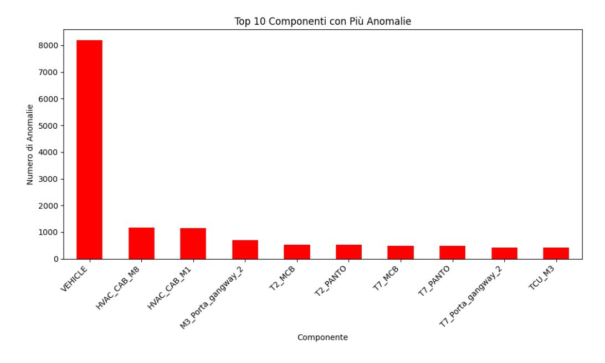

Figura 4.1: Top 10 componenti con più anomalie.

#### Top 10 componenti con più eventi normali

Il secondo grafico evidenzia i componenti con il maggior numero di eventi classificati come funzionamento normale. Anche in questo caso, il componente Vehicle figura tra i primi, mostrando un buon equilibrio tra eventi normali e anomalie.

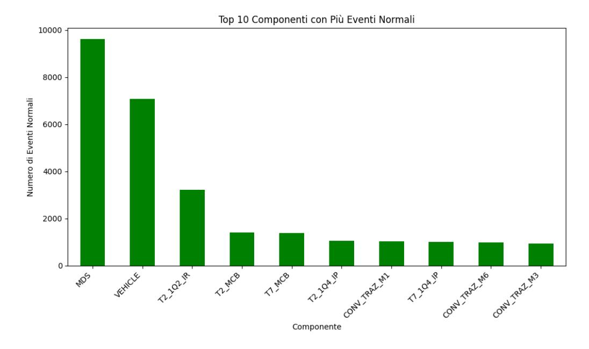

Figura 4.2: Top 10 componenti con più eventi normali.

#### Distribuzione totale degli eventi

Un grafico a torta è stato utilizzato per rappresentare la distribuzione totale degli eventi nel dataset. La maggior parte degli eventi è classificata come funzionamento normale, ma le anomalie rappresentano una percentuale significativa.

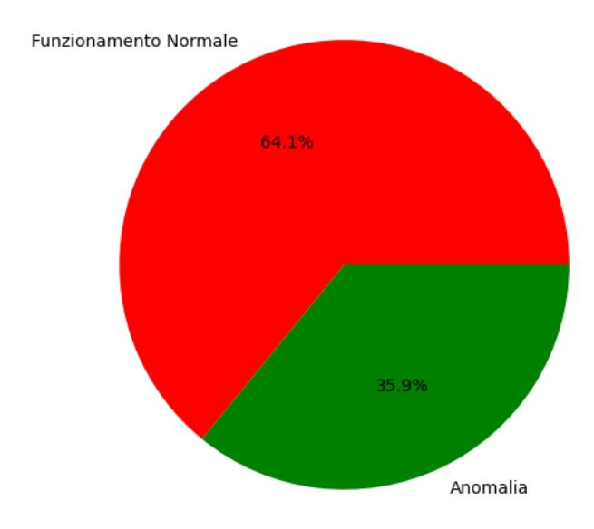

Figura 4.3: Distribuzione totale di anomalie ed eventi normali.

## 4.4 Filtraggio del dataset per il componente 'vehicle'

Per concentrare l'analisi sul componente Vehicle, il dataset è stato filtrato selezionando esclusivamente le righe associate a questo componente. Successivamente, sono state rimosse le colonne contenenti solo valori mancanti, al fine di semplificare e ottimizzare il dataset per le analisi successive.

#### Codice utilizzato

Il seguente codice Python è stato utilizzato per eseguire il filtraggio:

```
1 # Filtraggio per il componente 'Vehicle ' e rimozione delle colonne vuote
2 df_vehicle = dataset [ dataset ['Componente '] == 'VEHICLE ']
3 df_vehicle_cleaned = df_vehicle . dropna ( axis =1 , how ='all ')
5 # Output delle dimensioni del dataset
6 print (f" Numero di righe prima del filtraggio : { dataset . shape [0]} ")
7 print (f" Numero di colonne prima della rimozione di colonne vuote : { dataset . shape
       [1]} ")
8 print (f" Numero di righe dopo il filtraggio : { df_vehicle_cleaned . shape [0]} ")
9 print (f" Numero di colonne dopo la rimozione di colonne vuote : { df_vehicle_cleaned .
       shape [1]} ")
```

Listing 4.2: Filtraggio del Dataset per il Componente 'Vehicle'

#### Risultati del filtraggio

Dopo il filtraggio, il dataset è stato significativamente ridotto nelle sue dimensioni, come mostrato di seguito:

- Numero di righe prima del filtraggio: 57,652.
- Numero di colonne prima della rimozione di colonne vuote: 170.
- Numero di righe dopo il filtraggio: 15,277.
- Numero di colonne dopo la rimozione di colonne vuote: 58.

#### Analisi del filtraggio

Il filtraggio ha ridotto in modo significativo il numero di righe e colonne, mantenendo però tutte le informazioni rilevanti per il componente Vehicle. Questa operazione è stata essenziale per semplificare il dataset e migliorare l'efficienza delle successive analisi e dell'addestramento del modello di machine learning.

## 4.5 Distribuzione degli eventi

Per analizzare la proporzione tra anomalie e funzionamenti normali nel dataset filtrato per il componente Vehicle, sono stati generati grafici a barre. Questi grafici forniscono una rappresentazione visiva della distribuzione degli eventi, consentendo di valutare l'equilibrio del dataset e la variabilità dei dati raccolti.

#### Codice per la generazione dei grafici

Il seguente codice Python è stato utilizzato per calcolare e visualizzare la distribuzione degli eventi nel dataset:

```
1 # Distribuzione degli eventi ( Anomalia vs Funzionamento Normale )
2 event_type = df_vehicle_cleaned [' Tipo_Evento ']. value_counts ()
4 # Grafico a barre
5 event_type . plot ( kind ='bar ', color =[ 'green ', 'red '])
6 plt . title (' Distribuzione degli Eventi ( Anomalia vs Funzionamento Normale )')
7 plt . xlabel ('Tipo di Evento ')
8 plt . ylabel ('Numero di Eventi ')
9 plt . show ()
11 # Distribuzione degli eventi univoci ( Descrizioni univoche )
12 df_unique_description = df_vehicle_cleaned [[ ' Descrizione ', ' Tipo_Evento ']].
        drop_duplicates ()
13 event_type = df_unique_description [' Tipo_Evento ']. value_counts ()
14
15 # Grafico a barre per eventi univoci
16 event_type . plot ( kind ='bar ', color =[ 'green ', 'red '])
17 plt . title (' Distribuzione degli Eventi ( Anomalia vs Funzionamento Normale )')
18 plt . xlabel ('Tipo di Evento ')
19 plt . ylabel ('Numero di Eventi ')
20 plt . show ()
```

Listing 4.3: Codice per la visualizzazione della distribuzione degli eventi

#### Risultati ottenuti

Sono stati generati due grafici per rappresentare la distribuzione degli eventi. Il primo grafico considera la distribuzione complessiva degli eventi classificati come anomalie o funzionamenti normali, mentre il secondo analizza esclusivamente descrizioni univoche, eliminando eventuali duplicati.

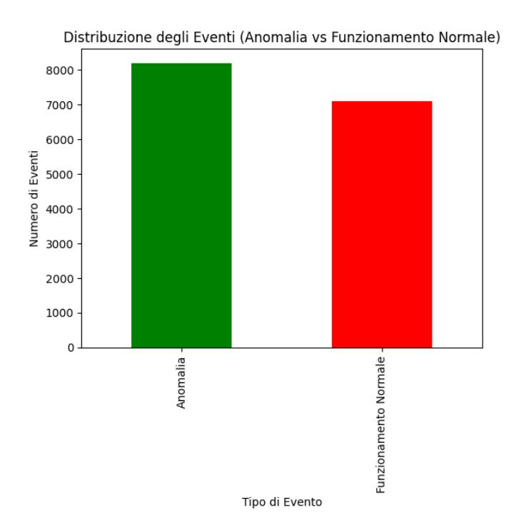

Figura 4.4: Distribuzione degli eventi (anomalia vs funzionamento normale).


Figura 4.5: Distribuzione degli eventi univoci (anomalia vs funzionamento normale).

#### Analisi dei grafici

• Distribuzione generale: Il primo grafico mostra che la distribuzione tra anomalie e funzionamenti normali è relativamente equilibrata, con una leggera prevalenza di anomalie. Questo equilibrio rende il dataset adatto all'addestramento di modelli di machine learning senza la necessità di ulteriori interventi per bilanciare le classi.

• Distribuzione di eventi univoci: Il secondo grafico, che esamina esclusivamente descrizioni univoche, rappresenta il numero di tipologie di log raccolti, evidenziando uno sbilanciamento verso i log di funzionamento normale.

## 4.6 Aggiunta della colonna 'Tipo\_Evento\_Classificato'

Per semplificare l'addestramento del modello di machine learning, è stata aggiunta una nuova colonna denominata Tipo\_Evento\_Classificato. Questa colonna converte i valori categoriali della colonna Tipo\_Evento in valori numerici binari, necessari per l'algoritmo di classificazione:

- 1: per eventi classificati come funzionamento normale.
- 0: per eventi classificati come anomalia.

#### Codice utilizzato

Il seguente codice Python è stato utilizzato per aggiungere la nuova colonna al dataset:

```
1 # Aggiunta della colonna binaria ' Tipo_Evento_Classificato '
2 df_vehicle_cleaned [' Tipo_Evento_Classificato '] = df_vehicle_cleaned [' Tipo_Evento '].
       apply (
3 lambda x: 1 if x == ' Funzionamento Normale ' else 0
4 )
6 # Visualizzazione delle prime righe del dataset aggiornato
7 df_vehicle_cleaned . head ()
```

Listing 4.4: Aggiunta della colonna 'Tipo\_Evento\_Classificato'

### Risultato

L'aggiunta della colonna Tipo\_Evento\_Classificato ha permesso di preparare il dataset per l'addestramento del modello di machine learning, che richiede variabili numeriche come input. Di seguito vengono evidenziate le principali modifiche al dataset:

- Colonna Tipo\_Evento: Mantiene i valori categoriali (funzionamento normale e anomalia) come riferimento testuale.
- Colonna Tipo\_Evento\_Classificato: Aggiunta come rappresentazione numerica binaria da utilizzare nel modello di machine learning.

Questa trasformazione rappresenta un passaggio fondamentale per garantire che il dataset sia compatibile con gli algoritmi di machine learning, migliorando al contempo la semplicità del processo di classificazione.

## 4.7 Rimozione delle righe con valori mancanti

Per garantire la qualità e l'affidabilità dei dati utilizzati nell'addestramento del modello di machine learning, sono state rimosse tutte le righe contenenti valori mancanti. Questo passaggio ha permesso di ottenere un dataset pulito, privo di valori nulli, che riduce il rischio di errori durante l'addestramento e migliora la robustezza del modello.

#### Codice utilizzato

Il seguente codice Python è stato utilizzato per effettuare la rimozione delle righe con valori mancanti:

```
1 # Rimozione delle righe con valori mancanti
2 df_cleaned_no_nan = df_vehicle_cleaned . dropna ()
4 # Controllo dei valori mancanti e salvataggio del dataset pulito
5 df_cleaned_no_nan . isnull () . sum () . sum () , df_cleaned_no_nan . shape
```

Listing 4.5: Rimozione delle righe con valori mancanti

#### Risultato

Il dataset risultante è stato completamente ripulito da valori nulli, come confermato dal controllo finale. Di seguito viene riportato il riepilogo delle modifiche apportate:

- Valori nulli rimanenti: 0.
- Dimensioni finali del dataset: il dataset ora contiene esclusivamente righe con informazioni complete.

## 4.8 Matrice di correlazione delle feature numeriche

La matrice di correlazione è stata calcolata per analizzare le relazioni tra le variabili numeriche del dataset filtrato per il componente Vehicle. Questo passaggio è fondamentale per rilevare delle correlazioni tra le feature e servirà in seguito per trovare una strategia adeguata per la creazione dei dati sintetici.

#### Cos'è Seaborn?

Seaborn è una libreria Python basata su Matplotlib, progettata per semplificare la creazione di grafici statistici avanzati. Grazie a un'interfaccia intuitiva, consente di generare visualizzazioni dettagliate, come la heatmap, che è stata utilizzata per rappresentare la matrice di correlazione. Questa visualizzazione aiuta a interpretare in modo immediato le relazioni tra le variabili numeriche.

#### Codice utilizzato

Il seguente codice Python è stato utilizzato per calcolare e rappresentare la matrice di correlazione:

```
1 # Importazione delle librerie necessarie
2 import seaborn as sns
4 # Calcolo della matrice di correlazione
5 correlation_matrix = df_vehicle_cleaned [ columns_to_generate ]. corr ()
7 # Visualizzazione della matrice di correlazione
8 plt . figure ( figsize =(20 , 15) )
9 sns . heatmap ( correlation_matrix , annot = True , cmap ='coolwarm ', linewidths =0.5)
10 plt . title ('Matrice di Correlazione delle Feature Numeriche ')
11 plt . show ()
```

Listing 4.6: Generazione della matrice di correlazione

#### Risultato

La matrice di correlazione è stata rappresentata graficamente tramite una heatmap, evidenziando i livelli di correlazione tra le variabili numeriche. I colori rappresentano la forza e la direzione della correlazione:

- Rosso intenso: correlazione positiva forte.
- Blu intenso: correlazione negativa forte.
- Sfumature intermedie: correlazioni più deboli o neutre.

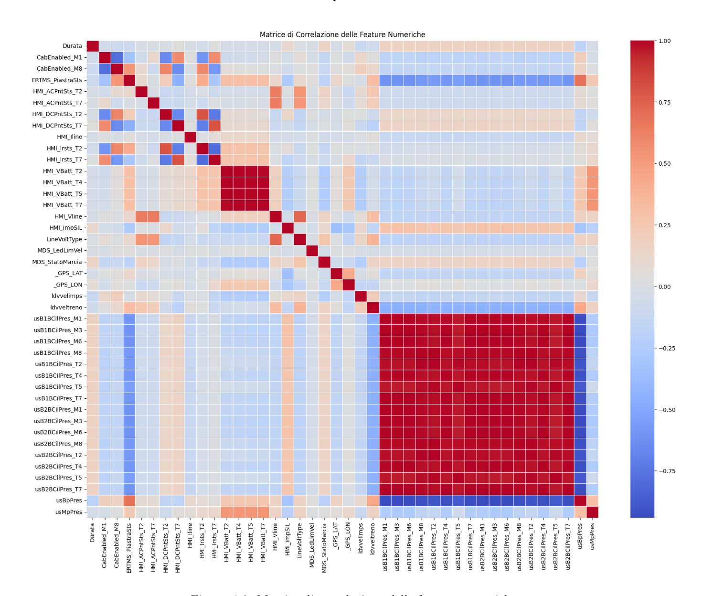

Figura 4.6: Matrice di correlazione delle feature numeriche.

#### Analisi della matrice di correlazione

L'analisi delle correlazioni tra le variabili ha permesso di identificare schemi significativi nel comportamento dei sensori, evidenziando interazioni rilevanti e anomalie operative. Inoltre, queste informazioni sono state fondamentali per confrontare i dati reali con quelli sintetici, verificando che i dati generati rispettassero le stesse relazioni presenti nei dati originali. Questo passaggio ha garantito una rappresentazione accurata delle variabili numeriche, ponendo le basi per la coerenza tra i dati reali e quelli simulati.

## 4.9 Addestramento del modello Random Forest e valutazione

Dopo aver discusso le principali caratteristiche dell'algoritmo Random Forest nel Capitolo 3, si passa ora all'implementazione e all'addestramento di tale metodo sul dataset predisposto. L'obiettivo rimane quello di classificare correttamente gli eventi registrati dai sensori installati sul treno come anomalie o funzionamenti normali.

#### Codice per l'addestramento del modello

Il codice seguente mostra la procedura Python utilizzata per addestrare e valutare il modello Random Forest. In sintesi, si effettua la pulizia e la preparazione dei dati (feature engineering), si suddivide il dataset in training set e test set e infine si addestra il classificatore, valutandone le prestazioni.

```
1 # Pre - elaborazione delle variabili di input e target
2 X_final = df_cleaned_no_nan . drop ( columns =[ ' Tipo_Evento_Classificato ', 'Tipo_Evento '
       , 'Descrizione ',
3 'Timestamp ', 'Timestamp chiusura ', '
                                                 Posizione ',
4 'Flotta ', 'Veicolo ', 'Codice ', 'Nome ', '
                                                 Test ', ' Contemporaneo ',
5 'Latitudine ', 'Longitudine '])
7 y_final = df_cleaned_no_nan [' Tipo_Evento_Classificato ']
8 y_final = y_final . replace ({1: ' Funzionamento Normale ', 0: 'Anomalia '})
10 # Rimozione delle colonne non numeriche
11 non_numeric_columns = X_final . select_dtypes ( include =[ 'object ']) . columns
12 X_final = X_final . drop ( columns = non_numeric_columns )
14 # Suddivisione del dataset in training e test set
15 from sklearn . model_selection import train_test_split
16 X_train , X_test , y_train , y_test = train_test_split (
17 X_final , y_final , test_size =0.2 , random_state =42
18 )
20 # Addestramento del modello Random Forest ( vedi Capitolo 3 per dettagli teorici )
21 from sklearn . ensemble import RandomForestClassifier
22 rf_model = RandomForestClassifier ( random_state =42 , n_estimators =100 , max_depth = None
       )
23 rf_model . fit ( X_train , y_train )
25 # Valutazione delle performance del modello
26 from sklearn . metrics import accuracy_score , classification_report , confusion_matrix
       , ConfusionMatrixDisplay
28 y_pred = rf_model . predict ( X_test )
30 accuracy = accuracy_score ( y_test , y_pred )
31 classification_rep = classification_report (
32 y_test , y_pred ,
33 target_names =[ 'Anomalia ', ' Funzionamento Normale ']
34 )
36 print (f" Accuratezza del modello : { accuracy :.4 f}")
37 print (" Report di classificazione :")
38 print ( classification_rep )
40 # Generazione della matrice di confusione
41 conf_matrix = confusion_matrix ( y_test , y_pred , labels =[ 'Anomalia ', ' Funzionamento
       Normale '])
42 disp = ConfusionMatrixDisplay ( confusion_matrix = conf_matrix ,
43 display_labels =[ 'Anomalia ', ' Funzionamento Normale '])
44 disp . plot ( cmap = plt . cm . Blues )
46 plt . title ('Confusion Matrix ')
47 plt . show ()
```

Listing 4.7: Addestramento e valutazione del modello Random Forest

#### Risultati

Il modello addestrato ha ottenuto le seguenti prestazioni:

- Accuratezza: 87,47%.
- Precisione e richiamo: Entrambe le metriche indicano un buon bilanciamento tra le due classi, con valori elevati sia per le anomalie sia per i funzionamenti normali.

Il classification report completo è riportato di seguito:

|                       | precision | recall | f1-score | support |
|-----------------------|-----------|--------|----------|---------|
|                       |           |        |          |         |
| Anomalia              | 0.88      | 0.89   | 0.89     | 1569    |
| Funzionamento Normale | 0.86      | 0.86   | 0.86     | 1303    |
|                       |           |        |          |         |
| accuracy              |           |        | 0.87     | 2872    |
| macro avg             | 0.87      | 0.87   | 0.87     | 2872    |
| weighted avg          | 0.87      | 0.87   | 0.87     | 2872    |

#### Matrice di confusione

La matrice di confusione generata per il modello è riportata in Figura 4.7. Questo strumento consente di valutare visivamente il numero di previsioni corrette ed errate per ciascuna classe.

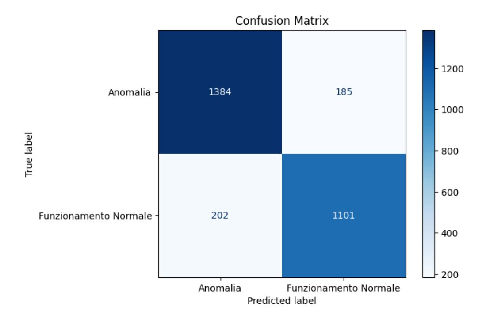

Figura 4.7: Matrice di confusione per il modello Random Forest.

#### Analisi dei risultati

• Accuratezza complessiva: Con un'accuratezza dell'87,47%, il modello mostra un'elevata capacità di classificare correttamente gli eventi.

- Bilanciamento delle classi: I valori di precisione e richiamo sono bilanciati tra le due classi (anomalia e funzionamento normale), suggerendo che il classificatore non privilegi una classe rispetto all'altra.
- Significato operativo: L'accuratezza elevata e le metriche bilanciate rendono il modello un valido strumento per il rilevamento di anomalie e la classificazione degli eventi. In ottica di manutenzione predittiva, ciò permette di individuare in anticipo le potenziali criticità.

## Capitolo 5

# Distribuzioni temporali dei log

Questo capitolo si concentra sull'analisi delle distribuzioni temporali degli eventi registrati nei log operativi, suddivisi nelle due categorie funzionali: funzionamenti normali e anomalie. L'obiettivo è identificare il comportamento temporale di entrambi i tipi di eventi, fornendo una base per la generazione di dati sintetici e per una migliore comprensione delle dinamiche del sistema.

L'analisi temporale rappresenta un passaggio importante per modellare il comportamento reale del sistema ferroviario, riproducendo in maniera fedele il flusso temporale degli eventi. In particolare:

- Sarà calcolato e visualizzato il tempo di interarrivo per entrambe le categorie (funzionamenti normali e anomalie).
- Verranno analizzati i modelli di distribuzione più adatti (ad esempio, distribuzione di Poisson o distribuzione esponenziale) per descrivere i dati temporali osservati.

Questa analisi è importante per generare dati sintetici che rispettino le caratteristiche dei dati reali garantendo scenari realistici e affidabili.

## 5.1 Pulizia e preparazione dei dati

Prima di procedere con l'analisi delle distribuzioni temporali degli eventi, è stato necessario preparare il dataset attraverso un processo di pulizia. Questa fase è serve a garantire che i dati siano privi di duplicati e valori mancanti nelle colonne temporali, assicurando così un'analisi accurata delle tempistiche tra gli eventi.

#### Codice utilizzato

Il seguente codice Python è stato impiegato per effettuare la pulizia e la preparazione del dataset:

```
1 # Conversione della colonna 'Timestamp ' in formato datetime
2 df_cleaned_no_nan ['Timestamp '] = pd . to_datetime ( df_cleaned_no_nan ['Timestamp '],
       errors ='coerce ')
4 # Rimozione di righe con valori mancanti nei campi temporali
5 vehicle_data_clean = df_cleaned_no_nan . dropna ( subset =[ 'Timestamp ', 'Timestamp
       chiusura '])
7 # Eliminazione dei duplicati basati su ' Descrizione ' e 'Timestamp '
8 vehicle_data_clean = vehicle_data_clean . drop_duplicates ( subset =[ ' Descrizione ', '
       Timestamp '])
10 # Verifica del numero di righe rimaste
11 print (f" Righe rimaste dopo la pulizia : { len ( vehicle_data_clean )}")
```

Listing 5.1: Pulizia e preparazione dei dati

A seguito della pulizia, il dataset risultante contiene un totale di 4,010 righe. Ogni evento registrato è ora univoco, e tutte le informazioni temporali necessarie sono complete. Questo dataset pulito sarà la base per l'analisi delle distribuzioni temporali che verrà affrontata nelle sezioni successive.

## 5.2 Calcolo del tempo di interarrivo delle anomalie

Un elemento fondamentale dell'analisi delle distribuzioni temporali è rappresentato dal calcolo del tempo di interarrivo tra gli eventi classificati come anomalia.

#### Codice utilizzato

Il seguente codice Python è stato utilizzato per calcolare i tempi di interarrivo delle anomalie:

```
1 # Filtraggio degli eventi classificati come 'Anomalia '
2 anomalies = vehicle_data_clean [ vehicle_data_clean [' Tipo_Evento '] == 'Anomalia ']
4 # Ordinamento degli eventi per timestamp
5 anomalies_sorted = anomalies . sort_values ( by ='Timestamp ')
7 # Calcolo del tempo di interarrivo delle anomalie
8 anomalies_sorted [' Interarrival_Time '] = anomalies_sorted ['Timestamp ']. diff () . dt .
       total_seconds ()
10 # Rimozione dei valori nulli
11 anomalies_interarrival = anomalies_sorted [' Interarrival_Time ']. dropna ()
13 # Verifica del numero di tempi di interarrivo calcolati
14 print (f" Numero di anomalie dopo il calcolo del tempo di interarrivo : { len (
       anomalies_interarrival )}")
```

Listing 5.2: Calcolo del tempo di interarrivo delle anomalie

### Risultato

Il calcolo del tempo di interarrivo ha prodotto un totale di 1,811 intervalli temporali.

## 5.3 Filtraggio del tempo di interarrivo

Per migliorare la qualità dei dati e ridurre l'impatto dei valori estremi o outlier, il tempo di interarrivo calcolato è stato filtrato utilizzando il criterio delle 2 deviazioni standard. Questo approccio consente di eliminare gli intervalli anomali che si discostano significativamente dalla media, preservando al contempo la maggior parte dei dati rilevanti.

#### Codice utilizzato

Il seguente codice Python è stato impiegato per applicare il filtro basato sulle deviazioni standard:

```
1 # Calcolo della media e della deviazione standard
2 mean_anomalies = anomalies_interarrival . mean ()
3 std_anomalies = anomalies_interarrival . std ()
4 # Filtraggio dei tempi di interarrivo
5 filtered_anomalies_interarrival = anomalies_interarrival [
6 ( anomalies_interarrival > mean_anomalies - 2 * std_anomalies ) &
7 ( anomalies_interarrival < mean_anomalies + 2 * std_anomalies )
8 ]
10 # Verifica del numero di intervalli rimasti dopo il filtraggio
11 print (f" Numero di anomalie dopo il filtraggio : { len ( filtered_anomalies_interarrival
       )}")
```

Listing 5.3: Filtraggio del tempo di interarrivo per deviazione standard

A seguito del filtraggio, il numero totale di tempi di interarrivo validi è stato ridotto a 1,790. Questo passaggio ha permesso di eliminare i valori estremi, garantendo una distribuzione dei dati più rappresentativa e affidabile per le analisi statistiche successive.

## 5.4 Analisi della distribuzione esponenziale dei tempi di interarrivo

L'obiettivo di questa analisi è verificare se i tempi di interarrivo delle anomalie possano essere descritti da una distribuzione esponenziale. Per farlo, è stato confrontato un istogramma dei dati filtrati con una curva teorica che rappresenta una distribuzione esponenziale.

#### Cos'è SciPy?

SciPy è una libreria Python avanzata per il calcolo scientifico, che fornisce strumenti per modellare distribuzioni probabilistiche e analizzare dati. In questa analisi, SciPy è stata utilizzata per generare la curva teorica della distribuzione esponenziale e sovrapporla ai dati reali.

#### Codice utilizzato

Il seguente codice Python è stato utilizzato per generare il confronto grafico:

```
1 from scipy . stats import expon
3 # Visualizzazione grafica
4 plt . figure ( figsize =(10 ,6) )
5 plt . hist ( filtered_anomalies_interarrival , bins =100 , density = True , alpha =0.6 , color =
        'g', label =' Interarrival Times ( Anomalies )')
6 plt . plot ( range (500) , expon . pdf ( range (500) , scale = filtered_anomalies_interarrival .
        mean () ) ,
7 'r-', lw =2 , label ='Exponential Distribution ( Theoretical )')
8 plt . title (' Distribuzione Esponenziale vs Tempi di Interarrivo delle Anomalie (
        Filtrati )')
9 plt . xlabel ('Tempo di Interarrivo ( secondi )')
10 plt . ylabel (' D e n s i t di p r o b a b i l i t ')
11 plt . xlim (0 , 500)
12 plt . legend ()
13 plt . show ()
```

Listing 5.4: Confronto tra istogramma e distribuzione esponenziale

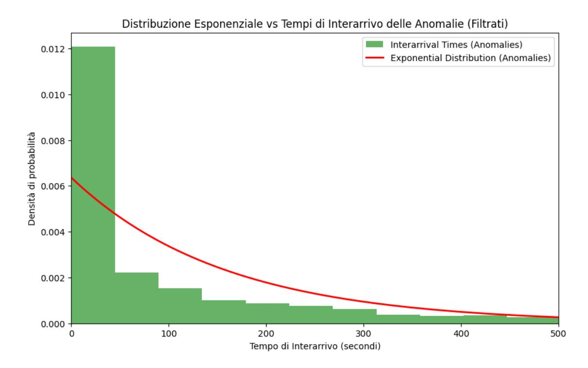

Figura 5.1: Distribuzione esponenziale vs tempi di interarrivo delle anomalie (filtrati).

La Figura 5.1 mostra il confronto tra i tempi di interarrivo delle anomalie filtrati e una curva teorica di distribuzione esponenziale. L'istogramma dei dati suggerisce che la distribuzione dei tempi di interarrivo può essere approssimata da una distribuzione esponenziale, specialmente per i valori più bassi.

## 5.5 Calcolo del tempo di interarrivo dei funzionamenti normali

Dopo aver calcolato il tempo di interrarrivo per le Anomalie, è il momento per gli eventi classificati come funzionamento normale. Questi dati, confrontati con quelli delle anomalie, permettono di individuare eventuali differenze nelle distribuzioni temporali dei due tipi di eventi.

#### Codice utilizzato

```
1 # Filtraggio degli eventi classificati come ' Funzionamento Normale '
2 normal_operations = vehicle_data_clean [ vehicle_data_clean [' Tipo_Evento '] == '
       Funzionamento Normale ']
4 # Ordinamento degli eventi per timestamp
5 normal_operations_sorted = normal_operations . sort_values ( by ='Timestamp ')
7 # Calcolo del tempo di interarrivo degli eventi normali
8 normal_operations_sorted [' Interarrival_Time '] = normal_operations_sorted ['Timestamp
       ']. diff () . dt . total_seconds ()
10 # Rimozione dei valori nulli
11 normal_interarrival = normal_operations_sorted [' Interarrival_Time ']. dropna ()
13 # Verifica del numero di tempi di interarrivo calcolati
14 print (f" Numero di operazioni normali dopo il calcolo del tempo di interarrivo : { len
       ( normal_interarrival )}")
```

Listing 5.5: Calcolo del tempo di interarrivo dei funzionamenti normali

Il calcolo del tempo di interarrivo ha prodotto un totale di 2,197 intervalli temporali tra gli eventi di funzionamento normale. Questi dati, insieme ai tempi di interarrivo delle anomalie, costituiscono la base per l'analisi comparativa e per la modellazione delle distribuzioni temporali.

## 5.6 Filtraggio del tempo di interarrivo dei funzionamenti normali

Per ridurre l'impatto di valori estremi, i tempi di interarrivo calcolati per gli eventi di funzionamento normale sono stati filtrati utilizzando il criterio delle 2 deviazioni standard. Questo approccio consente di preservare i dati più rappresentativi eliminando gli outlier.

#### Codice utilizzato

```
1 # Calcolo della media e della deviazione standard
2 mean_normal = normal_interarrival . mean ()
3 std_normal = normal_interarrival . std ()
5 # Filtraggio dei tempi di interarrivo
6 filtered_normal_interarrival = normal_interarrival [
7 ( normal_interarrival > mean_normal - 2 * std_normal ) &
8 ( normal_interarrival < mean_normal + 2 * std_normal )
9 ]
11 # Verifica del numero di intervalli rimasti dopo il filtraggio
12 print (f" Numero di operazioni normali dopo il filtraggio : { len(
       filtered_normal_interarrival )}")
```

Listing 5.6: Filtraggio del tempo di interarrivo per deviazione standard

#### Risultato

Dopo il filtraggio, il numero totale di intervalli temporali validi per gli eventi di funzionamento normale è stato ridotto a 2,150. Questo passaggio garantisce una distribuzione dei dati più coerente e priva di valori estremi, pronta per l'analisi successiva.

## 5.7 Analisi della distribuzione dei tempi di interarrivo per i funzionamenti normali

Per verificare se i tempi di interarrivo degli eventi di funzionamento normale possano essere descritti da una distribuzione esponenziale, è stato confrontato un istogramma dei dati filtrati con una curva teorica della distribuzione esponenziale.

#### Codice utilizzato

```
1 from scipy . stats import expon
3 # Visualizzazione grafica
4 plt . figure ( figsize =(10 ,6) )
5 plt . hist ( filtered_normal_interarrival , bins =100 , density = True , alpha =0.6 , color ='b'
       , label =' Interarrival Times ( Normal Operations )')
6 plt . plot ( range (500) , expon . pdf ( range (500) , scale = filtered_normal_interarrival . mean
       () ) ,
```

```
7 'r-', lw =2 , label ='Exponential Distribution ( Theoretical )')
8 plt . title (' Distribuzione Esponenziale vs Tempi di Interarrivo dei Funzionamenti
        Normali ')
9 plt . xlabel ('Tempo di Interarrivo ( secondi )')
10 plt . ylabel (' D e n s i t di p r o b a b i l i t ')
11 plt . xlim (0 , 500)
12 plt . legend ()
13 plt . show ()
```

Listing 5.7: Confronto tra sitogramma e distribuzione esponenziale

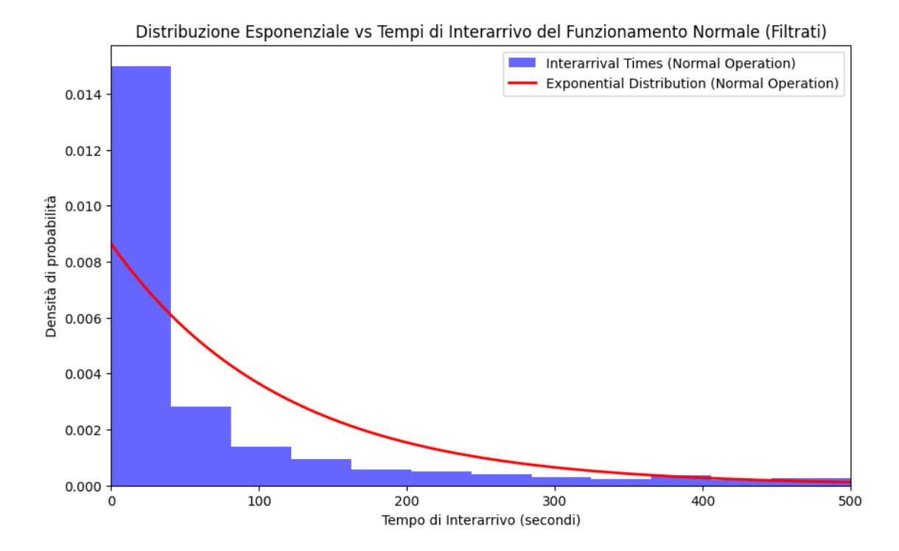

Figura 5.2: Distribuzione esponenziale vs tempi di interarrivo dei funzionamenti normali (filtrati).

La Figura 5.2 mostra il confronto tra i tempi di interarrivo degli eventi di funzionamento normale filtrati e una curva teorica di distribuzione esponenziale. L'istogramma suggerisce che i tempi di interarrivo possono essere approssimati da una distribuzione esponenziale.

## 5.8 Calcolo di media e mediana dei tempi di interarrivo

Per analizzare in dettaglio le distribuzioni temporali degli eventi, sono stati calcolati i valori di media e mediana dei tempi di interarrivo per le Anomalie e i Funzionamenti Normali, utilizzando i dati filtrati. Questi valori offrono un'indicazione sintetica della tendenza centrale e permettono di valutare eventuali asimmetrie nella distribuzione dei dati.

#### Codice utilizzato

Il seguente codice Python è stato utilizzato per calcolare i valori di media e mediana:

```
1 # Calcolo della media e della mediana per le anomalie filtrate
2 mean_filtered_anomalies = filtered_anomalies_interarrival . mean ()
3 median_filtered_anomalies = filtered_anomalies_interarrival . median ()
4 print (f" Media dei tempi di interarrivo delle anomalie filtrate : {
       mean_filtered_anomalies }")
```

```
5 print (f" Mediana dei tempi di interarrivo delle anomalie filtrate : {
       median_filtered_anomalies }")
7 # Calcolo della media e della mediana per i funzionamenti normali filtrati
8 mean_filtered_normal = filtered_normal_interarrival . mean ()
9 median_filtered_normal = filtered_normal_interarrival . median ()
10 print (f" Media dei tempi di interarrivo del funzionamento normale filtrato : {
       mean_filtered_normal }")
11 print (f" Mediana dei tempi di interarrivo del funzionamento normale filtrato : {
       median_filtered_normal }")
```

Listing 5.8: Calcolo di media e mediana dei tempi di interarrivo

#### Risultati

I risultati del calcolo sono riportati nella Tabella 5.1.

Tabella 5.1: Media e mediana dei tempi di interarrivo filtrati.

| Tipo di evento        | Media (s) | Mediana (s) |
|-----------------------|-----------|-------------|
| Anomalie              | 157.11    | 30.20       |
| Funzionamento normale | 115.66    | 22.30       |

#### Osservazioni

- Anomalie: La media dei tempi di interarrivo delle anomalie è notevolmente più alta rispetto alla mediana, suggerendo la presenza di valori estremi (outlier) che influenzano la media.
- Funzionamenti normali: Per i funzionamenti normali si osserva un comportamento simile, ma con valori di media e mediana complessivamente inferiori rispetto alle anomalie, riflettendo una maggiore frequenza di eventi.
- Distribuzione: L'evidente differenza tra media e mediana in entrambe le categorie di eventi indica una distribuzione asimmetrica, tipica di processi con tempi di interarrivo variabili.

## Capitolo 6

# Generazione dei dati sintetici

## Introduzione

Questo capitolo descrive i metodi e le tecniche adottate per la generazione di dati sintetici, basati sulle analisi effettuate nei capitoli precedenti. La generazione di dati sintetici è una pratica essenziale in contesti in cui la disponibilità di dati reali è limitata o in cui l'accesso ai dati è vincolato da requisiti di privacy o riservatezza aziendale.

L'obiettivo principale è ricreare, in maniera statistica e temporale, eventi che riproducano fedelmente i comportamenti osservati nei dati reali. In particolare:

- Saranno utilizzate le distribuzioni temporali identificate nei log per generare eventi sintetici che rispettino le caratteristiche temporali emerse, sia per le anomalie che per i funzionamenti normali.
- Verranno applicati modelli statistici, come la distribuzione esponenziale, per replicare i tempi di interarrivo tra eventi in modo realistico.
- Saranno analizzati i risultati della generazione sintetica per verificare la coerenza e la fedeltà rispetto ai dati reali.

La generazione di dati sintetici riveste un ruolo chiave in diversi ambiti:

- Addestramento di modelli di machine learning: Creazione di dataset estesi e bilanciati per migliorare le prestazioni dei modelli predittivi.
- Simulazioni di scenari fittizi: Utilizzo di dati generati artificialmente per simulare il comportamento del sistema in scenari ipotetici o futuri.
- Analisi di sensibilità: Test e validazione di algoritmi di manutenzione predittiva in condizioni controllate e riproducibili.

In questo capitolo verranno illustrati i metodi impiegati per la generazione di dati sintetici, presentando il codice implementato, i parametri adottati e i risultati ottenuti, con particolare attenzione al confronto tra dati sintetici e reali.

## 6.1 Preparazione del dataset per la generazione

La generazione di dati sintetici richiede una preparazione accurata del dataset. In questa fase, il dataset è stato suddiviso in due sottogruppi distinti: eventi classificati come anomalia ed eventi classificati come funzionamento normale, utilizzando la colonna Tipo\_Evento\_Classificato.

#### Codice utilizzato

Il seguente codice Python è stato utilizzato per caricare il dataset e suddividerlo nei due sottogruppi:

```
1 # Caricamento del dataset
2 print (f" Dataset caricato con { len ( df_cleaned_no_nan )} righe .")
4 # Selezione degli eventi di anomalia e funzionamento normale
5 df_anomalie = df_cleaned_no_nan [ df_cleaned_no_nan [' Tipo_Evento_Classificato '] == 0]
6 df_normali = df_cleaned_no_nan [ df_cleaned_no_nan [' Tipo_Evento_Classificato '] == 1]
8 # Verifica del numero di eventi selezionati
9 print (f" Eventi di anomalia selezionati : { len ( df_anomalie )} righe .")
10 print (f" Eventi di funzionamento normale selezionati : { len ( df_normali )} righe .")
```

Listing 6.1: Caricamento e selezione del dataset

#### Risultati

I risultati della suddivisione del dataset sono riportati di seguito:

- Numero totale di eventi: 14,356 righe.
- Eventi di anomalia: 7,766 righe.
- Eventi di funzionamento normale: 6,590 righe.

#### Osservazioni

Questa suddivisione del dataset permette di analizzare separatamente le caratteristiche dei due tipi di evento. Tale approccio è cruciale per:

- Generare dati sintetici che rispettino le distribuzioni temporali caratteristiche di ciascun gruppo, come analizzato nei capitoli precedenti.
- Garantire che i dati sintetici prodotti rappresentino fedelmente i comportamenti distinti degli eventi di anomalia e di funzionamento normale.

## 6.2 Rimozione dei duplicati consecutivi

Per migliorare la qualità del dataset e ottimizzare le prestazioni della modellazione statistica, in particolare nell'applicazione della copula gaussiana, è stata effettuata una pulizia dei dati tramite la rimozione dei duplicati consecutivi. Questo processo è stato applicato sia agli eventi di anomalia sia agli eventi di funzionamento normale, garantendo una rappresentazione più fedele e compatta dei dati.

#### Codice utilizzato

Il seguente codice Python è stato implementato per rimuovere i duplicati consecutivi dai due dataset:

```
1 # Rimozione dei duplicati consecutivi per le anomalie
2 columns_to_check = [' Descrizione ', 'Timestamp ', 'Codice ', 'Nome ']
3 df_deduplicated_anomalies = df_anomalie . loc [
4 ( df_anomalie [ columns_to_check ] != df_anomalie [ columns_to_check ]. shift () ). any (
            axis =1)
5 ]
7 print (f" Righe originali ( anomalie ): { len ( df_anomalie )}")
8 print (f" Righe dopo rimozione delle ridondanze ( anomalie ): {len (
       df_deduplicated_anomalies )}")
10 # Rimozione dei duplicati consecutivi per i funzionamenti normali
```

```
11 df_deduplicated_normals = df_normali . loc [
12 ( df_normali [ columns_to_check ] != df_normali [ columns_to_check ]. shift () ) .any ( axis
            =1)
13 ]
14
15 print (f" Righe originali ( normali ): {len ( df_normali )}")
16 print (f" Righe dopo rimozione delle ridondanze ( normali ): { len(
        df_deduplicated_normals )}")
```

Listing 6.2: Rimozione dei duplicati consecutivi

#### Risultati

I risultati della rimozione dei duplicati consecutivi sono riportati di seguito:

- Eventi di anomalia:
  - Righe originali: 7,766.
  - Righe dopo la rimozione delle ridondanze: 1,828.
- Eventi di funzionamento normale:
  - Righe originali: 6,590.
  - Righe dopo la rimozione delle ridondanze: 2,198.

#### Vantaggi della pulizia dei dati

La rimozione dei duplicati consecutivi ha apportato i seguenti vantaggi:

- Efficienza computazionale: Riducendo la dimensione dei dataset, il processo di modellazione statistica risulta più veloce e meno oneroso in termini di risorse computazionali.
- Accuratezza della modellazione: La rimozione delle ridondanze migliora la rappresentatività dei dati, riducendo il rischio di bias dovuto alla ripetizione degli stessi eventi.
- Fedelità ai dati reali: Garantisce che i dati sintetici generati siano basati su una rappresentazione più chiara e non ridondante degli eventi reali.

## 6.3 Generazione di dati sintetici con copula Gaussiana

Dopo aver illustrato i principi e i vantaggi dell'utilizzo delle copule nel Capitolo 3, in questa sezione si presenta l'applicazione pratica della copula gaussiana per la generazione di dati sintetici. L'obiettivo è ampliare il dataset con campioni aggiuntivi che mantengano le stesse proprietà statistiche osservate nei dati reali, simulando scenari futuri o proteggendo la privacy dei log originali.

#### Codice per la generazione dei dati sintetici

Di seguito è riportato lo script Python utilizzato per costruire e campionare la copula gaussiana. Il processo prevede l'adattamento (fit) ai dati reali, la fase di sampling e l'eventuale aggiunta di colonne specifiche (come la Durata o la classificazione dell'evento).

```
1 from copulas . multivariate import GaussianMultivariate
2 import numpy as np
4 # Preparazione dei dati per la copula
5 data_anomalies = df_deduplicated_anomalies . drop ( columns =[ 'Durata '])
6 data_normals = df_deduplicated_normals . drop ( columns =[ 'Durata '])
8 # Modellazione con copula gaussiana
9 copula_anomalies = GaussianMultivariate ()
10 copula_anomalies . fit ( data_anomalies )
```

```
12 copula_normals = GaussianMultivariate ()
13 copula_normals . fit ( data_normals )
14
15 # Generazione di dati sintetici
16 synthetic_anomalies = copula_anomalies . sample (len ( data_anomalies ) )
17 synthetic_normals = copula_normals . sample ( len ( data_normals ) )
19 # Aggiunta della variabile " Durata " con distribuzione lognormale
20 alpha , beta = 0.2 , 1.9
21 synthetic_anomalies ['Durata '] = np . random . lognormal (
22 mean = np . log (157 * alpha ) ,
23 sigma = beta ,
24 size = len ( synthetic_anomalies )
25 )
26 synthetic_normals ['Durata '] = np . random . lognormal (
27 mean = np . log (115 * alpha ) ,
28 sigma = beta ,
29 size = len ( synthetic_normals )
30 )
32 # Aggiunta delle colonne per classificazione
33 synthetic_anomalies [' Tipo_Evento '] = " Anomalia "
34 synthetic_normals [' Tipo_Evento '] = " Funzionamento Normale "
35 synthetic_anomalies [' Tipo_Evento_Classificato '] = 0
36 synthetic_normals [' Tipo_Evento_Classificato '] = 1
```

Listing 6.3: Generazione di dati sintetici con copula Gaussiana

#### Risultati e osservazioni

- Preservazione delle correlazioni: I campioni sintetici generati riflettono le relazioni esistenti tra le variabili reali, grazie alla matrice di correlazione appresa dalla copula gaussiana.
- Distribuzione marginale della durata: La variabile Durata è stata volutamente modellata con una distribuzione lognormale, definita sulla base di alcuni parametri derivati dall'analisi statistica dei dati reali.
- Etichette per la classificazione: Ogni campione sintetico è etichettato come anomalia o funzionamento normale, semplificando l'uso di tali dati aggiuntivi nell'addestramento o nella validazione dei modelli di machine learning.

### Conclusioni

L'adozione della copula Gaussiana ha permesso di generare dati sintetici che mantengono le relazioni statistiche dei log originali, ampliando il dataset a disposizione per l'addestramento e la validazione dei modelli di anomaly detection. Nei capitoli successivi verrà mostrato come questi dati sintetici vengano effettivamente integrati e valutati nell'ambito del workflow di manutenzione predittiva.

## 6.4 Valutazione dei dati sintetici generati

La valutazione dei dati sintetici generati con la Copula Gaussiana è stata effettuata considerando due aspetti principali:

- Coerenza statistica: Valutata attraverso il calcolo di media, mediana e matrice di correlazione.
- Prestazioni del modello Random Forest: Verificata testando il modello addestrato sui dati reali sui dati sintetici.

#### 6.4.1 Media e mediana dei tempi di interarrivo

Per analizzare la coerenza statistica, sono stati calcolati la media e la mediana dei tempi di interarrivo per le anomalie e i funzionamenti normali nei dati sintetici.

#### Codice utilizzato

```
1 # Calcolo della media e della mediana per i dati sintetici
2 mean_filtered_synthetic_anomalies = synthetic_us_anomalie ['Durata ']. mean ()
3 median_filtered_synthetic_anomalies = synthetic_us_anomalie ['Durata ']. median ()
4 mean_filtered_synthetic_normal = synthetic_us_normali ['Durata ']. mean ()
5 median_filtered_synthetic_normal = synthetic_us_normali ['Durata ']. median ()
```

Listing 6.4: Calcolo di media e mediana dei tempi di interarrivo

#### Risultati ottenuti

• Dati sintetici per le anomalie:

– Media: 182.93 secondi – Mediana: 29.98 secondi

• Dati sintetici per i funzionamenti normali:

– Media: 133.44 secondi – Mediana: 21.96 secondi

I risultati mostrano che i dati sintetici mantengono le caratteristiche statistiche principali dei dati reali, con valori di media e mediana compatibili con quelli osservati.

#### 6.4.2 Matrice di correlazione delle feature numeriche

Come ulteriore verifica di coerenza, è stata calcolata la matrice di correlazione delle variabili numeriche nei dati sintetici, confrontandola con le relazioni già osservate nei dati reali. Dato l'utilizzo di una copula gaussiana (che apprende e riproduce esplicitamente la struttura di dipendenza), ci si attendeva che tali correlazioni venissero preservate in modo pressoché identico.

#### Codice utilizzato

```
1 # Calcolo della matrice di correlazione per le anomalie
2 numerical_columns = synthetic_us_anomalie . select_dtypes ( include =[ 'float64 ', 'int64 '
       ]) . columns
3 correlation_matrix_anomalie = synthetic_us_anomalie [ numerical_columns ]. corr ()
5 # Visualizzazione della matrice di correlazione per le anomalie
6 plt . figure ( figsize =(20 , 15) )
7 sns . heatmap ( correlation_matrix_anomalie , annot = True , cmap ='coolwarm ', linewidths
       =0.5)
8 plt . title ('Matrice di Correlazione delle Feature Numeriche ( Anomalie )')
9 plt . show ()
```

Listing 6.5: Matrice di correlazione dei dati sintetici

#### Risultati ottenuti

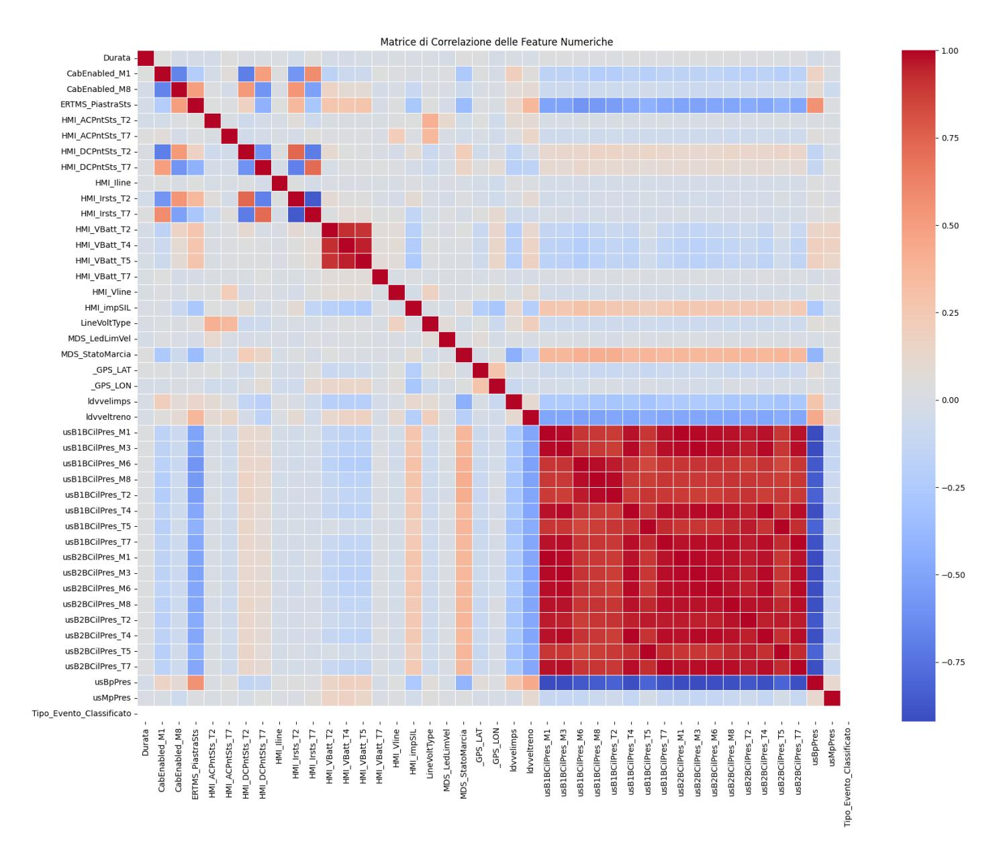

Figura 6.1: Matrice di correlazione per le feature numeriche nei dati sintetici (anomalie).

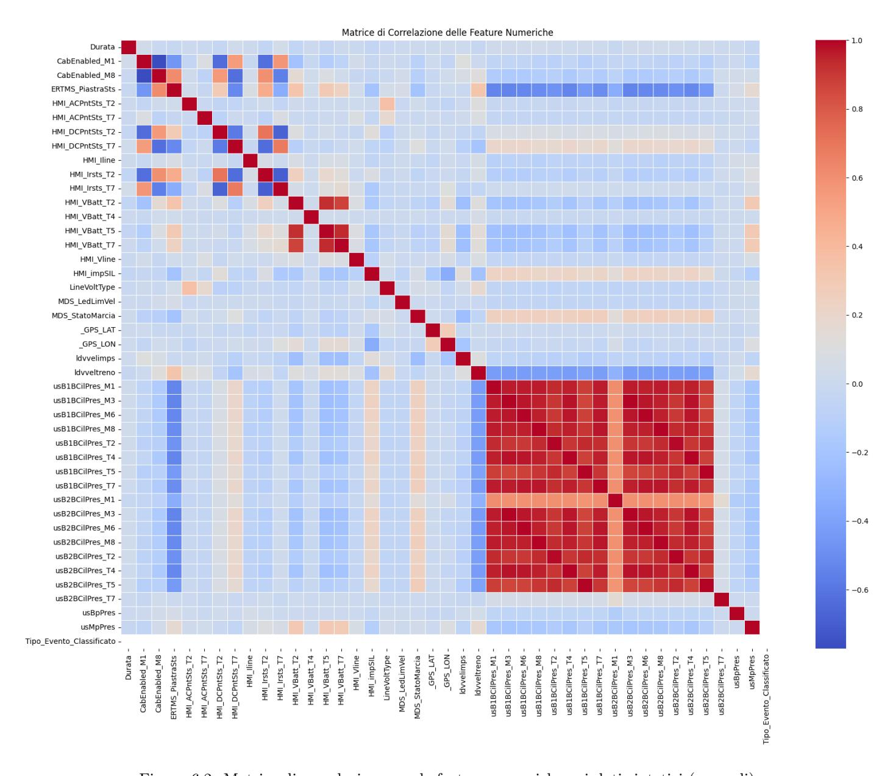

Figura 6.2: Matrice di correlazione per le feature numeriche nei dati sintetici (normali).

#### Analisi dei risultati

Non sorprende che le correlazioni tra le variabili nei dati sintetici riflettano fedelmente quelle riscontrate nei dati reali: la copula gaussiana, infatti, apprende espressamente la matrice di correlazione per riprodurla nei campioni generati. Questo controllo funge dunque da "prova del nove", confermando che la struttura di dipendenza è stata correttamente trasferita dal dataset originale ai dati sintetici, senza introdurre distorsioni significative.

## 6.5 Valutazione del modello Random Forest sui dati sintetici

Per verificare l'efficacia dei dati sintetici generati, sia per le anomalie sia per i funzionamenti normali, è stato testato lo stesso modello Random Forest addestrato sui dati reali. In altre parole, si valuta quanto il classificatore (allenato esclusivamente su log reali) riesca a distinguere correttamente gli eventi sintetici come anomalie o funzionamenti normali, verificando così il grado di realismo dei dati generati.

#### Codice utilizzato

Il listato Python seguente illustra il processo di valutazione per entrambi i set sintetici: da un lato i dati di anomalie, dall'altro i dati di funzionamenti normali. Dopo aver rimosso eventuali colonne non numeriche o ridondanti, si effettua la predizione (predict) con il modello rf\_model, calcolando infine l'accuratezza, il report di classificazione e la confusion matrix per ciascun gruppo.

```
1 ### ANOMALIE SINTETICHE
2 X_sintetici_anomalie = synthetic_us_anomalie . drop (
3 columns =[ ' Tipo_Evento_Classificato ', 'Timestamp ', 'Timestamp chiusura '],
4 errors ='ignore '
5 )
6 non_numeric_columns_sintetici_anomalie = X_sintetici_anomalie . select_dtypes ( include
       =[ 'object ']) . columns
7 X_sintetici_anomalie = X_sintetici_anomalie . drop ( columns =
       non_numeric_columns_sintetici_anomalie )
9 y_sintetici_true_anomalie = ['Anomalia '] * len ( X_sintetici_anomalie )
10 y_pred_sintetici_anomalie = rf_model . predict ( X_sintetici_anomalie )
12 acc_anomalie = accuracy_score ( y_sintetici_true_anomalie , y_pred_sintetici_anomalie )
13 rep_anomalie = classification_report (
14 y_sintetici_true_anomalie ,
15 y_pred_sintetici_anomalie ,
16 target_names =[ 'Anomalia ', ' Funzionamento Normale '] ,
17 zero_division =1
18 )
19 cm_anomalie = confusion_matrix (
20 y_sintetici_true_anomalie ,
21 y_pred_sintetici_anomalie ,
22 labels =[ 'Anomalia ', ' Funzionamento Normale ']
23 )
24
25 ### FUNZIONAMENTI NORMALI SINTETICI
26 X_sintetici_normali = synthetic_us_normali . drop (
27 columns =[ ' Tipo_Evento_Classificato ', 'Timestamp ', 'Timestamp chiusura '],
28 errors ='ignore '
29 )
30 non_numeric_columns_sintetici_normali = X_sintetici_normali . select_dtypes ( include =[
       'object ']) . columns
31 X_sintetici_normali = X_sintetici_normali . drop ( columns =
       non_numeric_columns_sintetici_normali )
33 y_sintetici_true_normali = [' Funzionamento Normale '] * len ( X_sintetici_normali )
34 y_pred_sintetici_normali = rf_model . predict ( X_sintetici_normali )
36 acc_normali = accuracy_score ( y_sintetici_true_normali , y_pred_sintetici_normali )
37 rep_normali = classification_report (
38 y_sintetici_true_normali ,
39 y_pred_sintetici_normali ,
40 target_names =[ 'Anomalia ', ' Funzionamento Normale '] ,
41 zero_division =1
42 )
43 cm_normali = confusion_matrix (
44 y_sintetici_true_normali ,
45 y_pred_sintetici_normali ,
46 labels =[ 'Anomalia ', ' Funzionamento Normale ']
47 )
49 # Stampa a console
50 print (f" Accuratezza ( Anomalie sintetiche ): { acc_anomalie :.2 f}")
51 print ( rep_anomalie )
52 print (f" Accuratezza ( Normali sintetici ): { acc_normali :.2 f}")
53 print ( rep_normali )
54
55 # Visualizzazione doppia Confusion Matrix ( Anomalie & Normali )
56 fig , axes = plt . subplots ( ncols =2 , figsize =(12 ,5) )
58 disp_anom = ConfusionMatrixDisplay ( conf_matrix = cm_anomalie ,
```

```
59 display_labels =[ 'Anomalia ',' Funzionamento
                                          Normale '])
60 disp_anom . plot ( ax = axes [0] , cmap = plt . cm . Blues , colorbar = False )
61 axes [0]. set_title ('Anomalie Sintetiche ')
63 disp_norm = ConfusionMatrixDisplay ( conf_matrix = cm_normali ,
64 display_labels =[ 'Anomalia ',' Funzionamento
                                          Normale '])
65 disp_norm . plot ( ax = axes [1] , cmap = plt . cm . Blues , colorbar = False )
66 axes [1]. set_title (' Funzionamenti Normali Sintetici ')
68 plt . tight_layout ()
69 plt . show ()
```

Listing 6.6: Valutazione Random Forest sui dati sintetici (anomalie e funzionamenti normali)

#### Risultati ottenuti

- Accuratezza (anomalie sintetiche): 69.15%
- Accuratezza (normali sintetici): 61.28%

Nel complesso, i dati sintetici generati permettono al classificatore di riconoscere in modo discreto le due classi (Anomalia e Funzionamento Normale), sebbene le performance siano inferiori rispetto all'addestramento sui dati reali.

#### Confusion matrix

Nella Figura 6.3 vengono mostrate, in un'unica visualizzazione, le confusion matrix corrispondenti ai due set sintetici (anomalie e funzionamenti normali). In entrambe, l'asse delle ascisse rappresenta il valore predetto (anomalia o funzionamento normale), mentre l'asse delle ordinate indica il valore effettivo (i.e., etichette "vere").

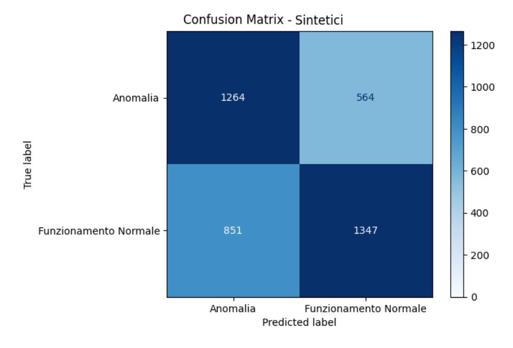

Figura 6.3: Confusion matrix per i dati sintetici.

#### Analisi dei risultati

- Anomalie sintetiche: L'accuratezza si attesta intorno al 69%, indicando che il modello riesce a riconoscere la classe "Anomalia" nel dataset sintetico in modo ragionevole ma non ottimale.
- Funzionamenti normali sintetici: L'accuratezza cala attorno al 61%, suggerendo che la generazione di log di funzionamenti normali potrebbe richiedere ulteriori raffinamenti o metodi di generazione più sofisticati.
- Margini di miglioramento: Differenze tra i log reali e quelli sintetici sono plausibili, specie se la struttura statistica o la variabilità non lineare dei dati non viene catturata pienamente dalla copula gaussiana.

Nel complesso, questi esperimenti mostrano che i dati sintetici ricreano uno scenario abbastanza coerente per testare algoritmi di anomaly detection, anche se permangono margini di miglioramento nella generazione dei funzionamenti normali.

## 6.6 Confronto grafico tra dataset pulito e sintetico

Per valutare la coerenza dei dati sintetici generati rispetto al dataset originale, sono state create rappresentazioni grafiche delle distribuzioni delle principali variabili numeriche. Le distribuzioni sono state calcolate e visualizzate per tre dataset:

- Dataset pulito: il dataset originale dopo la pulizia e la pre-elaborazione.
- Dataset sintetico anomalie: dati sintetici generati dalla copula gaussiana per le anomalie.
- Dataset sintetico normali: dati sintetici generati dalla copula gaussiana per i funzionamenti normali.

#### Codice utilizzato

```
1 import matplotlib . pyplot as plt
3 # Configurazione delle dimensioni delle figure
4 plt . rcParams [" figure . figsize "] = (10 , 6)
6 # Colonne comuni tra i dataset
7 common_columns = synthetic_us_anomalie . columns . intersection ( synthetic_us_normali .
        columns )
9 # Filtraggio del dataset pulito
10 filtered_dataset_cleaned = df_cleaned_no_nan [ common_columns ]
12 # Generazione dei grafici per ciascuna colonna comune
13 for column in common_columns :
14 plt . figure ()
15 plt . hist ( filtered_dataset_cleaned [ column ]. dropna () , bins =30 , alpha =0.5 , label ='
            Dataset Cleaned ', density = True )
16 plt . hist ( synthetic_us_anomalie [ column ]. dropna () , bins =30 , alpha =0.5 , label ='
            Dataset Sintetico Anomalie ', density = True )
17 plt . hist ( synthetic_us_normali [ column ]. dropna () , bins =30 , alpha =0.5 , label ='
            Dataset Sintetico Normali ', density = True )
19 plt . title (f' Distribution of { column }')
20 plt . xlabel ( column )
21 plt . ylabel ('Density ')
22 plt . legend ()
23 plt . show ()
```

Listing 6.7: Confronto delle distribuzioni tra dataset pulito e sintetico

#### Risultati

Di seguito sono riportati esempi rappresentativi delle distribuzioni per alcune variabili numeriche comuni tra i tre dataset:

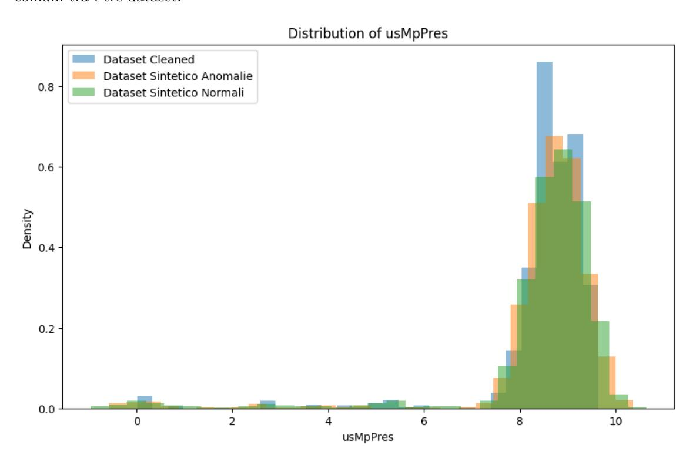

Figura 6.4: Distribuzione della variabile usMpPres per i tre dataset.

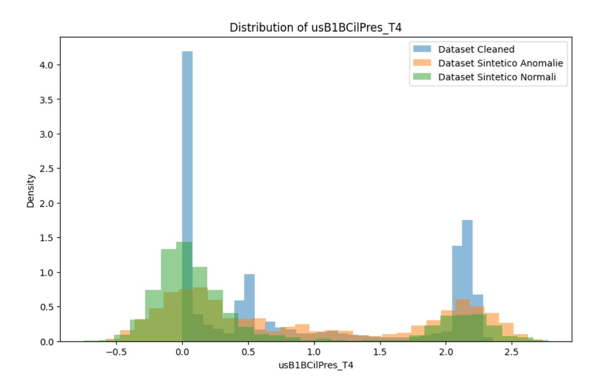

Figura 6.5: Distribuzione della variabile usB2BCilPres\_T4 per i tre dataset.

#### Analisi delle distribuzioni

- Le distribuzioni dei dati sintetici sono, in generale, coerenti con quelle del dataset originale. Le somiglianze dimostrano che la copula gaussiana è in grado di riprodurre le caratteristiche statistiche dei dati reali.
- Le variabili analizzate mostrano una buona sovrapposizione tra i dati originali e sintetici, sebbene alcune differenze siano evidenti in presenza di picchi o distribuzioni asimmetriche.
- La rappresentazione delle anomalie sintetiche appare generalmente più vicina ai dati originali rispetto ai funzionamenti normali, ma ciò potrebbe essere dovuto alla diversa densità e variabilità delle due classi.

Questa analisi grafica fornisce un'ulteriore conferma della validità dei dati sintetici generati e della loro idoneità per le successive fasi di modellazione e simulazione.

## Capitolo 7

# Script per la generazione dei log

## 7.1 Panoramica dello script finale di generazione dei log

Lo script presentato in questo capitolo è stato progettato per simulare la generazione continua di log sintetici, replicando le caratteristiche temporali e statistiche dei dati reali analizzati nei capitoli precedenti. Questo strumento rappresenta una soluzione automatizzata per la creazione di log realistici, utili per scenari di test e simulazioni.

#### Obiettivi dello script

La struttura dello script è stata progettata per soddisfare i seguenti obiettivi:

- Generazione di log sintetici: Creare dataset sintetici basati su copule gaussiane, includendo sia eventi di anomalie che di funzionamenti normali.
- Simulazione in tempo reale: Aggiungere log sintetici a un file di destinazione, simulando il comportamento di un sistema in tempo reale.
- Rigenerazione automatica: Monitorare il numero di log disponibili e rigenerare automaticamente i dataset sintetici quando il numero di righe scende sotto una soglia predefinita.

#### Struttura dello script

Lo script è organizzato in modo modulare per garantire flessibilità e riusabilità. Le funzionalità principali includono:

- Configurazione dei parametri: Definizione dei parametri iniziali come il numero di log da generare, il percorso del file di destinazione e le soglie per la rigenerazione automatica.
- Generazione dei log: Implementazione di algoritmi basati sulle copule gaussiane per creare eventi sintetici coerenti con le distribuzioni statistiche dei dati reali.
- Scrittura incrementale dei log: Gestione della scrittura dei log in un file di destinazione per simulare un flusso continuo di eventi.
- Monitoraggio della disponibilità dei log: Implementazione di un sistema di controllo per rigenerare i dati sintetici quando necessario.

#### Importanza dello script

Questo script rappresenta un elemento fondamentale del progetto, in quanto consente di:

• Fornire un dataset sintetico realistico per testare e validare sistemi di manutenzione predittiva.

- Simulare scenari operativi in modo riproducibile, riducendo la dipendenza dai dati reali e rispettando eventuali restrizioni di privacy.
- Automatizzare il processo di generazione dei log, riducendo l'intervento manuale e garantendo flessibilità in scenari dinamici.

Nei paragrafi successivi verranno illustrati in dettaglio l'architettura dello script, il codice implementato e i risultati ottenuti.

## 7.2 Funzionamento dello script

Lo script è organizzato in diverse funzioni principali:

- rigeneraDatasetSintetico: utilizza la copula gaussiana per rigenerare dataset sintetici basati sulle caratteristiche statistiche dei dati reali.
- aggiungoRigaAlFileDiDestinazione: aggiunge una nuova riga al file di destinazione, selezionandola casualmente tra i dataset sintetici di anomalie e funzionamenti normali.
- generazioneContinuataDataset: gestisce la generazione continua di log sintetici, monitorando la disponibilità di righe nei dataset sintetici e avviando la rigenerazione quando necessario.

## 7.3 Codice dello script

Di seguito è riportato il codice Python completo per la generazione continua dei log sintetici.

```
1 import pandas as pd
2 import numpy as np
3 import time
4 from concurrent . futures import ThreadPoolExecutor
5 from copulas . multivariate import GaussianMultivariate
6 import warnings
7 import os
8 from datetime import timedelta
9 from random import uniform
11 columns_to_generate = [
12 'Durata ', ' CabEnabled_M1 ', ' CabEnabled_M8 ', ' ERTMS_PiastraSts ', '
            HMI_ACPntSts_T2 ', ' HMI_ACPntSts_T7 ',
13 ' HMI_DCPntSts_T2 ', ' HMI_DCPntSts_T7 ', 'HMI_Iline ', ' HMI_Irsts_T2 ', '
            HMI_Irsts_T7 ', ' HMI_VBatt_T2 ',
14 ' HMI_VBatt_T4 ', ' HMI_VBatt_T5 ', ' HMI_VBatt_T7 ', 'HMI_Vline ', 'HMI_impSIL ', '
            LineVoltType ', ' MDS_LedLimVel ',
15 ' MDS_StatoMarcia ', '_GPS_LAT ', '_GPS_LON ', 'ldvvelimps ', 'ldvveltreno ', '
            usB1BCilPres_M1 ', ' usB1BCilPres_M3 ',
16 ' usB1BCilPres_M6 ', ' usB1BCilPres_M8 ', ' usB1BCilPres_T2 ', ' usB1BCilPres_T4 ', '
            usB1BCilPres_T5 ', ' usB1BCilPres_T7 ',
17 ' usB2BCilPres_M1 ', ' usB2BCilPres_M3 ', ' usB2BCilPres_M6 ', ' usB2BCilPres_M8 ', '
            usB2BCilPres_T2 ', ' usB2BCilPres_T4 ',
18 ' usB2BCilPres_T5 ', ' usB2BCilPres_T7 ', 'usBpPres ', 'usMpPres '
19 ]
21 all_columns = [
22 'Flotta ', 'Veicolo ', 'Codice ', 'Nome ', ' Descrizione ', 'Test ', 'Timestamp ', '
            Timestamp chiusura ', 'Durata ',
23 'Posizione ', 'Sistema ', 'Componente ', 'Latitudine ', ' Longitudine ', '
            Contemporaneo ', 'Timestamp segnale '
24 ] + columns_to_generate + [' Tipo_Evento ', ' Tipo_Evento_Classificato ']
26 timestamp_iniziale = pd . Timestamp . now ()
28 def rigeneraDatasetSintetico ( file_anomalie , file_normali , df_anomalie , df_normali ,
       num_righe ):
29 warnings . filterwarnings (" ignore ", category = RuntimeWarning )
```

```
31 df_anomalie_copula = df_anomalie . drop ( columns =[ 'Durata '] , errors ='ignore ')
32 df_normali_copula = df_normali . drop ( columns =[ 'Durata '], errors ='ignore ')
34 copula_anomalie = GaussianMultivariate ()
35 copula_anomalie . fit ( df_anomalie_copula )
36 synthetic_anomalie = copula_anomalie . sample ( num_righe // 2)
38 copula_normali = GaussianMultivariate ()
39 copula_normali . fit ( df_normali_copula )
40 synthetic_normali = copula_normali . sample ( num_righe // 2)
42 alpha = 0.2
43 beta = 1.9
44 media_durata_anomalie = 157 * alpha
45 media_durata_normali = 115 * alpha
46 sigma_anomalie = 1 * beta
47 sigma_normali = 1 * beta
49 synthetic_anomalie ['Durata '] = np . random . lognormal ( mean = np . log (
           media_durata_anomalie ) , sigma = sigma_anomalie , size = len( synthetic_anomalie ))
50 synthetic_normali ['Durata '] = np . random . lognormal ( mean = np . log (
           media_durata_normali ) , sigma = sigma_normali , size = len ( synthetic_normali ))
52 for df in [ synthetic_anomalie , synthetic_normali ]:
53 df ['Flotta '] = 'ETR700 '
54 df ['Veicolo '] = 'e700_4801 '
55 df ['Test '] = 'N'
56 df ['Timestamp '] = pd . Timestamp . now ()
57 df ['Timestamp chiusura '] = df ['Timestamp '] + pd . to_timedelta ( df ['Durata '],
               unit ='s')
58 df ['Posizione '] = np . nan
59 df ['Sistema '] = 'VEHICLE '
60 df ['Componente '] = 'VEHICLE '
61 df ['Timestamp segnale '] = np . nan
63 for col in all_columns :
64 if col not in synthetic_anomalie . columns :
65 synthetic_anomalie [ col ] = np . nan
66 if col not in synthetic_normali . columns :
67 synthetic_normali [ col ] = np . nan
69 synthetic_anomalie = synthetic_anomalie . round (2)
70 synthetic_normali = synthetic_normali . round (2)
72 synthetic_anomalie = synthetic_anomalie [ all_columns ]
73 synthetic_normali = synthetic_normali [ all_columns ]
74
75 synthetic_anomalie . to_csv ( file_anomalie , index = False )
76 synthetic_normali . to_csv ( file_normali , index = False )
78 warnings . filterwarnings (" default ", category = RuntimeWarning )
79 print (f" Dataset sintetici rigenerati : { file_anomalie } e { file_normali }")
81 def aggiungoRigaAlFileDiDestinazione ( file_output , file_anomalie , file_normali ):
82 global timestamp_iniziale
84 if np . random . rand () < 0.5:
85 dataset_file = file_anomalie
86 tipo_evento = 'Anomalia '
87 tipo_evento_classificato = 0
88 else :
89 dataset_file = file_normali
90 tipo_evento = ' Funzionamento Normale '
91 tipo_evento_classificato = 1
93 dataset_sintetico = pd . read_csv ( dataset_file )
94 nuova_riga = dataset_sintetico . iloc [0]. copy ()
95 dataset_sintetico = dataset_sintetico . iloc [1:]
```

```
97 nuova_riga ['Timestamp '] = timestamp_iniziale
98 nuova_riga ['Timestamp chiusura '] = timestamp_iniziale + pd . to_timedelta (
            nuova_riga ['Durata '] , unit ='s')
99 nuova_riga ['Timestamp segnale '] = timestamp_iniziale + timedelta ( seconds =
            uniform (0 , 1) )
101 nuova_riga [' Tipo_Evento '] = tipo_evento
102 nuova_riga [' Tipo_Evento_Classificato '] = tipo_evento_classificato
104 if not os . path . exists ( file_output ):
105 nuova_riga . to_frame () .T. to_csv ( file_output , mode ='a', header = all_columns ,
                index = False )
106 else :
107 nuova_riga . to_frame () .T. to_csv ( file_output , mode ='a', header = False , index =
                False )
108
109 dataset_sintetico . to_csv ( dataset_file , index = False )
111 timestamp_iniziale = pd . Timestamp . now ()
112 print (f" Riga sintetica aggiunta dal dataset { tipo_evento }")
114 def generazioneContinuataDataset ( file_output , file_anomalie , file_normali ,
        df_anomalie , df_normali , soglia =100 , num_righe_rigenerazione =1000) :
115 executor = ThreadPoolExecutor ( max_workers =2)
116 rigenerazione_in_corso = None
118 while True :
119 dataset_anomalie = pd . read_csv ( file_anomalie )
120 dataset_normali = pd . read_csv ( file_normali )
122 if ( len ( dataset_anomalie ) < soglia or len ( dataset_normali ) < soglia ) and
                rigenerazione_in_corso is None :
123 rigenerazione_in_corso = executor . submit (
124 rigeneraDatasetSintetico , file_anomalie , file_normali , df_anomalie ,
                         df_normali , num_righe_rigenerazione
125 )
126 print (" Rigenerazione del dataset sintetico avviata in parallelo .")
128 durata = dataset_anomalie . iloc [0]. get ('Durata ', 1) if np . random . rand () <
                0.5 else dataset_normali . iloc [0]. get ('Durata ', 1)
129 time . sleep ( durata )
130 aggiungoRigaAlFileDiDestinazione ( file_output , file_anomalie , file_normali )
132 if rigenerazione_in_corso and rigenerazione_in_corso . done () :
133 print (" Rigenerazione completata .")
134 rigenerazione_in_corso = None
136 columns_to_check = [' Descrizione ', 'Timestamp ', 'Codice ', 'Nome ']
137 df_deduplicated_anomalies = df_anomalie . loc [( df_anomalie [ columns_to_check ] !=
        df_anomalie [ columns_to_check ]. shift () ). any ( axis =1) ]
138 df_deduplicated_normals = df_normali . loc [( df_normali [ columns_to_check ] !=
        df_normali [ columns_to_check ]. shift () ). any ( axis =1) ]
140 rigeneraDatasetSintetico (
141 ' dataset_sintetico_anomalie . csv ',
142 ' dataset_sintetico_normali . csv ',
143 df_deduplicated_anomalies [ columns_to_generate ],
144 df_deduplicated_normals [ columns_to_generate ],
145 num_righe =1000
146 )
148 generazioneContinuataDataset (
149 ' dataset_destinazione . csv ',
150 ' dataset_sintetico_anomalie . csv ',
151 ' dataset_sintetico_normali . csv ',
152 df_deduplicated_anomalies [ columns_to_generate ],
153 df_deduplicated_normals [ columns_to_generate ]
154 )
```

Listing 7.1: Script per la generazione continua di log sintetici

## 7.4 Conclusioni

Lo script sviluppato per la generazione di log sintetici rappresenta un'importante componente del progetto, consentendo di simulare in modo realistico il comportamento temporale del sistema ferroviario. Grazie alla combinazione di metodi di machine learning e modellazione statistica, lo script permette di:

- generare log sintetici per anomalie e funzionamenti normali, preservando le caratteristiche distribuzionali dei dati originali;
- supportare applicazioni in tempo reale, simulando il flusso continuo di dati;
- facilitare lo sviluppo e il testing di algoritmi di manutenzione predittiva e rilevamento di anomalie, senza dipendere esclusivamente dai dati reali.

La flessibilità dello script, unita all'integrazione di librerie avanzate come copulas, numpy e pandas, lo rende adatto a diversi scenari applicativi. In particolare, la possibilità di configurare i parametri di generazione e rigenerazione consente di adattare lo script a differenti esigenze operative, garantendo un'elevata personalizzazione.

In prospettiva, è possibile migliorare ulteriormente lo script includendo:

- nuove variabili di simulazione, per arricchire i log generati;
- tecniche avanzate di modellazione, come copule più complesse o modelli generativi di deep learning;
- meccanismi di validazione automatica per verificare la coerenza dei dati generati con i dati reali.

Questo script rappresenta, quindi, un punto di partenza solido per la creazione di log sintetici realistici, contribuendo significativamente all'analisi predittiva e alla simulazione in ambito ferroviario.

## Capitolo 8

# Conclusioni e sviluppi futuri

L'obiettivo principale di questa tesi è stato quello di affrontare la carenza di dati di qualità nel contesto della manutenzione predittiva ferroviaria, proponendo un sistema per la generazione di dati sintetici realistici. L'approccio proposto ha inizialmente fatto ricorso a metodologie statistiche basate sulle copule (in particolare la copula gaussiana) per la generazione di nuovi dati, e successivamente ha utilizzato tecniche di machine learning (come il Random Forest) per validare la strategia di creazione dei dati sintetici. In questo modo è stato possibile dimostrare che è effettivamente realizzabile la creazione di dati aggiuntivi che conservino la struttura di dipendenza e le proprietà marginali dei log reali.

## Risultati raggiunti

In particolare, il lavoro svolto ha previsto:

- Analisi del dataset reale: Sono state individuate le variabili critiche e le principali correlazioni e caratteristiche temporali, allo scopo di comprendere la struttura del sistema e preparare i dati per successive fasi di modellazione.
- Pre-elaborazione dei dati: Attraverso operazioni di filtraggio, rimozione di duplicati e gestione di valori mancanti, il dataset è stato reso coerente e privo di rumore, migliorandone la qualità complessiva.
- Generazione di dati sintetici: Mediante l'utilizzo di copule gaussiane [15, 14, 10] si sono prodotti dati addizionali in grado di preservare le distribuzioni marginali e le correlazioni tra le variabili. Tali dati sintetici forniscono una data augmentation di valore, specialmente in scenari dove gli eventi di guasto sono rari.
- Validazione con modelli di machine learning: L'impiego di un modello di classificazione (Random Forest [3, 13]) ha permesso di verificare la capacità dei dati sintetici di supportare efficacemente il rilevamento di anomalie, confermando la validità dell'approccio adottato.
- Script per generazione continua di log: È stato sviluppato uno script automatizzato per la creazione continua di log sintetici, simulando un flusso costante di dati (senza rivelare i log originali), con potenziali applicazioni in contesti di testing e validazione.

I risultati ottenuti dimostrano che i dati sintetici generati mantengono relazioni significative fra le variabili (correlazioni, dipendenze lineari o moderatamente non lineari) e conservano le principali proprietà statistiche del dataset reale [7]. Ciò si traduce in un notevole vantaggio per tutti i casi in cui l'accesso a log completi e di alta qualità risulti limitato.

## Integrazione con altre tecnologie e copule alternative

Nel corso di questa tesi, si è fatto uso di copule gaussiane per la loro semplicità di implementazione e adeguatezza alle correlazioni lineari prevalenti nel dataset ferroviario. Tuttavia, esistono altre famiglie di copule, quali le copule di Clayton, Gumbel o t-Student, che risultano particolarmente indicate in presenza di correlazioni fortemente non lineari, code pesanti o asimmetrie [14, 10]. Un'evoluzione naturale del presente lavoro potrebbe consistere nello sperimentare tali famiglie alternative, confrontandone la capacità di generare dati sintetici in scenari operativi con comportamenti più estremi o non lineari.

Allo stesso tempo, la comunità scientifica sta esplorando con sempre maggior interesse i Large Language Models (LLM), come GPT-4 o ChatGPT [4, 5], che, pur essendo nati per la gestione del linguaggio naturale, iniziano a essere adattati a contesti di generazione e interpretazione di dati complessi. Sebbene l'applicazione diretta dei LLM nella generazione di dati tabellari strutturati non sia ancora molto diffusa, alcuni studi preliminari mostrano potenzialità interessanti, in particolare quando i log contengano campi testuali o etichette descrittive [9]. L'integrazione di modelli generativi deep (GAN, VAE) [11, 8, 1] e la sperimentazione con LLM potrebbero quindi rappresentare ulteriori direzioni di ricerca.

## Sviluppi Futuri

Benché i risultati raggiunti siano promettenti, esistono diverse direzioni nelle quali il presente lavoro può essere esteso:

- Metodi di generazione dati più avanzati: Integrare Generative Adversarial Networks (GAN) [11, 8, 1] o Variational Autoencoder (VAE) per migliorare il realismo dei dati sintetici in scenari caratterizzati da relazioni non lineari più complesse.
- Copule più sofisticate o ibride: Valutare l'uso di copule non gaussiane (ad esempio t-Student) o di copule ibride per catturare in modo più accurato correlazioni asimmetriche o code pesanti, frequenti in alcuni componenti ferroviari.
- Integrazione di ulteriori fonti di informazione: Considerare dati eterogenei (condizioni meteo, stato dell'infrastruttura, profili di traffico) per creare dataset sintetici più ricchi e multidimensionali, in linea con le proposte di integrazione [19].
- Valutazione quantitativa dell'impatto: Definire metriche specifiche per misurare l'effettivo contributo dei dati sintetici nell'addestramento di modelli di manutenzione predittiva, ad esempio analizzando l'incremento di f1-score o la riduzione degli errori di classificazione.
- Generalizzazione ad altri ambiti: Applicare l'approccio di generazione dati sintetici e copule anche in settori industriali quali l'automotive o l'aerospaziale, dove la disponibilità di dati di qualità rappresenta una sfida analoga [16].

## Conclusioni

La generazione di dati sintetici, congiunta all'uso di tecniche di machine learning, si conferma uno strumento potente per superare i vincoli imposti dalla scarsa disponibilità di dati reali in ambito ferroviario. L'adozione di copule gaussiane ha mostrato come sia possibile ampliare il dataset, mantenendo le principali caratteristiche statistiche e garantendo così una base solida per l'addestramento e la validazione di modelli di manutenzione predittiva.

Le possibili evoluzioni del lavoro spaziano dall'esplorazione di copule più sofisticate, all'integrazione di LLM e modelli deep di generazione dati, fino alla generalizzazione ad altri settori industriali. In un panorama tecnologico in costante cambiamento, la capacità di adattarsi a nuovi scenari e di sfruttare tecniche di data-driven analytics di frontiera risulta sempre più decisiva per realizzare soluzioni innovative e competitive.

# Bibliografia

- [1] M. Arjovsky, S. Chintala, L. Bottou, Wasserstein GAN, Proceedings of the 34th International Conference on Machine Learning (ICML), 2017.
- [2] A. Babic, R. Stojanovic, P. Vulic, A Systematic Review of Anomaly Detection in Big Data Environments with Machine Learning Methods, Applied Sciences, 12(4), 2347, 2022.
- [3] L. Breiman, Random Forests, Machine Learning, 45(1), 5–32, 2001.
- [4] T. Brown, B. Mann, N. Ryder, M. Subbiah, J. Kaplan, P. Dhariwal, . . . , D. Amodei, Language Models are Few-Shot Learners, Advances in Neural Information Processing Systems (NeurIPS), 33, 1877–1901, 2020.
- [5] S. Bubeck, V. Chandrasekaran, R. Eldan, J. Gehrke, E. Horvitz, E. Kamar, . . . , Y. Zhang, Sparks of Artificial General Intelligence: Early Experiments with GPT-4, arXiv preprint, arXiv:2303.12712, 2023.
- [6] V. Chandola, A. Banerjee, V. Kumar, Anomaly Detection: A Survey, ACM Computing Surveys, 41(3), 1–58, 2009.
- [7] Z. Chen, W. Zhang, Z. Feng, Data-driven Predictive Maintenance for Railway Systems: A Comprehensive Survey, Mechanical Systems and Signal Processing, 140, 106584, 2020.
- [8] A. Creswell, T. White, V. Dumoulin, K. Arulkumaran, B. Sengupta, A. A. Bharath, Generative Adversarial Networks: An Overview, IEEE Signal Processing Magazine, 35(1), 53–65, 2018.
- [9] J. Devlin, M.-W. Chang, K. Lee, K. Toutanova, BERT: Pre-training of Deep Bidirectional Transformers for Language Understanding, Proceedings of the 2019 Conference of the North American Chapter of the Association for Computational Linguistics (NAACL-HLT), 4171– 4186, 2019.
- [10] F. Durante, C. Sempi, Principles of Copula Theory, CRC Press, 2015.
- [11] I. Goodfellow, J. Pouget-Abadie, M. Mirza, B. Xu, D. Warde-Farley, S. Ozair, . . . , Y. Bengio, Generative Adversarial Nets, Advances in Neural Information Processing Systems (NeurIPS), 27, 2672–2680, 2014.
- [12] H. Huang, Y. Wu, X. Lai, Q. He, Deep Learning-based Approach for Early Detection of Point Machine Failures in Railway Systems, Transportation Research Part C: Emerging Technologies, 93, 232–248, 2018.
- [13] R. Jia, L. Xia, J. Zhang, W. Su, Fault Diagnosis of Railway Traction Systems using Improved Random Forest Algorithm, IEEE Access, 7, 79211–79221, 2019.
- [14] H. Joe, Dependence Modeling with Copulas, CRC Press, 2014.
- [15] R. B. Nelsen, An Introduction to Copulas (2nd ed.), Springer, 2006.
- [16] T. Nguyen, D. S. Lakehal, M. Gaber, Machine Learning Approaches for Predictive Maintenance: A Survey, Future Generation Computer Systems, 127, 59–78, 2022.

- [17] R. Qi, Y. Wang, C. Zhao, Y. Zhao, J. Wang, J. Zhang, A Machine Learning-based Approach for Early Detection of Point Machine Failures in High-speed Railway Systems, IEEE Transactions on Intelligent Transportation Systems, 21(12), 5303–5313, 2020.
- [18] Y. Xiao, B. Wen, Anomaly Detection in Large-Scale Sensor Data: A Review, Sensors, 21(5), 1509, 2021.
- [19] T. Zhou, J. Li, L. Ren, G. Song, J. Chen, A Deep Learning-based Approach for Complex Fault Detection in High-speed Railway Wheel–Rail Systems, Mechanical Systems and Signal Processing, 168, 108643, 2022.
- [20] Q. Zou, J. Li, W. Jiang, Z. Lin, Machine Learning-based Anomaly Detection for Railway Operational Safety, Journal of Rail Transport Planning & Management, 13, 100012, 2020.